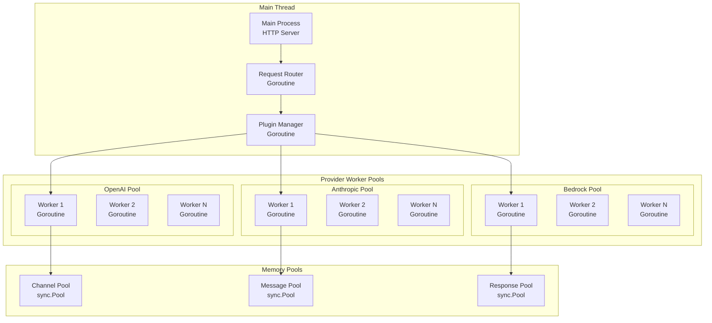
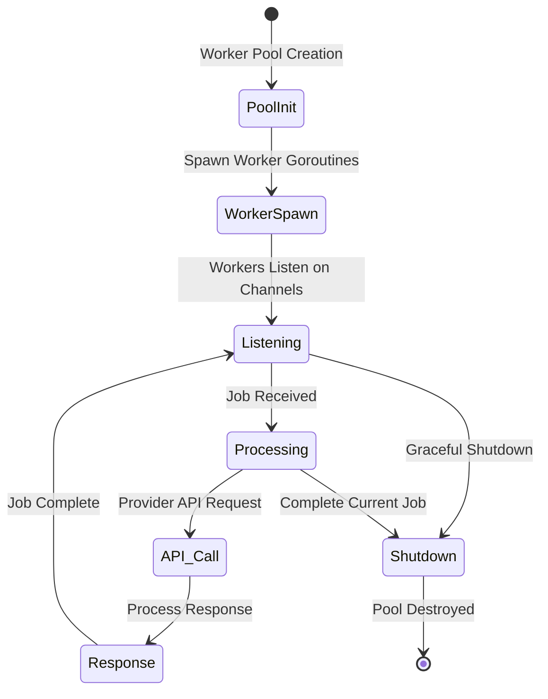
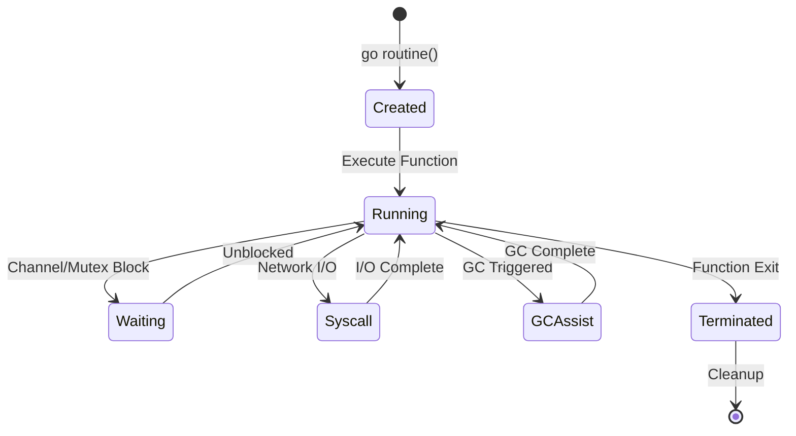
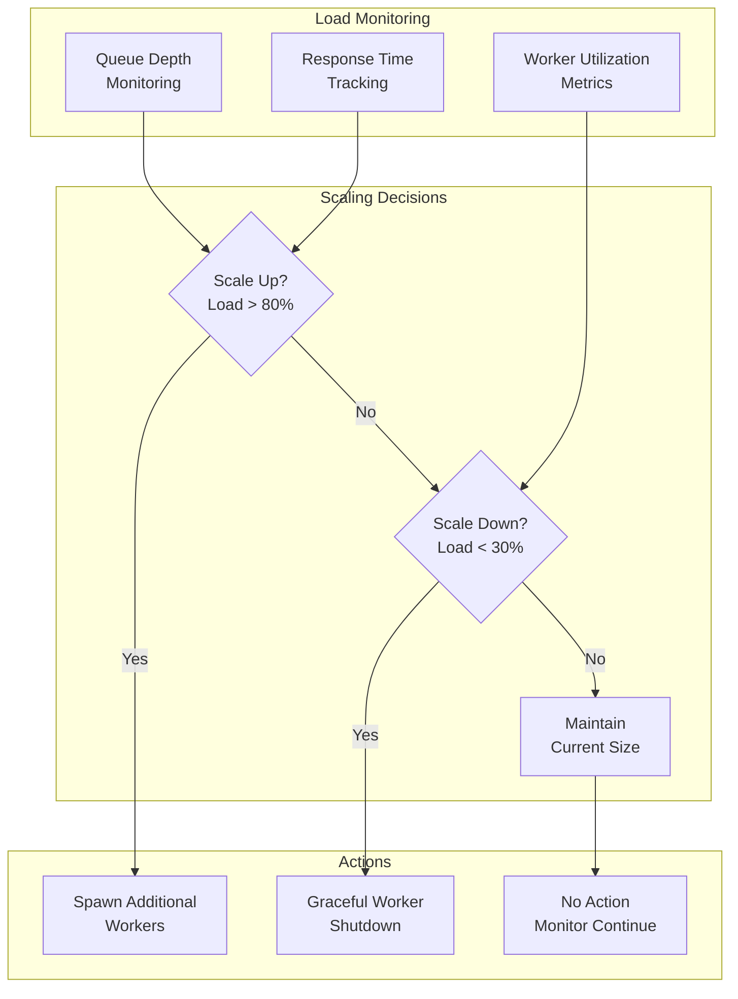
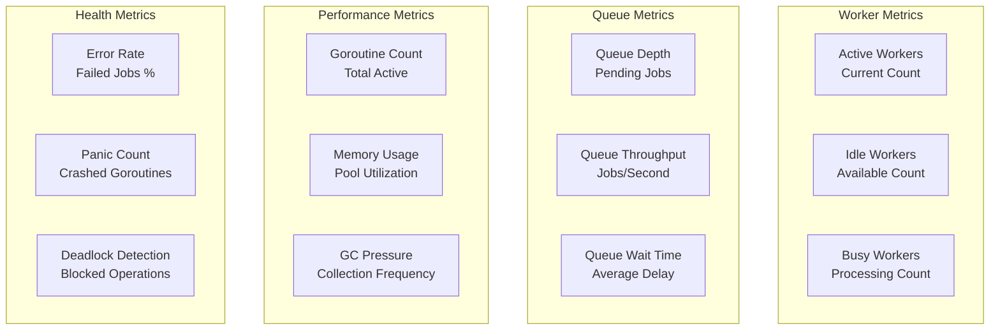

## Concurrency Philosophy

### **Core Principles**

| Principle                          | Implementation                         | Benefit                                |
| ---------------------------------- | -------------------------------------- | -------------------------------------- |
| **Provider Isolation**          | Independent worker pools per provider  | Fault tolerance, no cascade failures   |
| **Channel-Based Communication** | Go channels for all async operations   | Type-safe, deadlock-free communication |
| **Resource Pooling**            | Object pools with lifecycle management | Predictable memory usage, minimal GC   |
| **Non-Blocking Operations**     | Async processing throughout pipeline   | Maximum concurrency, no blocking waits |
| **Backpressure Handling**       | Configurable buffers and flow control  | Graceful degradation under load        |

### **Threading Architecture Overview**



---

## Worker Pool Architecture

### **Provider-Isolated Worker Pools**



**Worker Pool Architecture:**

The worker pool system maintains a sophisticated balance between resource efficiency and performance isolation:

**Key Components:**

- **Worker Pool Management** - Pre-spawned workers reduce startup latency
- **Job Queue System** - Buffered channels provide smooth load balancing
- **Resource Pools** - HTTP clients and API keys are pooled for efficiency
- **Health Monitoring** - Circuit breakers detect and isolate failing providers
- **Graceful Shutdown** - Workers complete current jobs before terminating

**Startup Process:**

1. **Worker Pre-spawning** - Workers are created during pool initialization
2. **Channel Setup** - Job queues and worker channels are established
3. **Resource Allocation** - HTTP clients and API keys are distributed
4. **Health Checks** - Initial connectivity tests verify provider availability
5. **Ready State** - Pool becomes available for request processing

**Job Dispatch Logic:**

- **Round-Robin Assignment** - Jobs are distributed evenly across available workers
- **Load Balancing** - Worker availability determines job assignment
- **Overflow Handling** - Excess jobs are queued or dropped based on configuration

### **Worker Lifecycle Management**

```mermaid
sequenceDiagram
    participant Pool
    participant Worker
    participant HTTPClient
    participant Provider
    participant Metrics

    Pool->>Worker: Start()
    Worker->>Worker: Initialize HTTP Client
    Worker->>Pool: Ready Signal

    loop Job Processing
        Pool->>Worker: Job Assignment
        Worker->>HTTPClient: Prepare Request
        HTTPClient->>Provider: API Call
        Provider-->>HTTPClient: Response
        HTTPClient-->>Worker: Parsed Response
        Worker->>Metrics: Record Performance
        Worker->>Pool: Job Complete
    end

    Pool->>Worker: Shutdown Signal
    Worker->>Worker: Complete Current Job
    Worker-->>Pool: Shutdown Confirmed
````

---

## Channel-Based Communication

### **Channel Architecture**

```mermaid
graph TB
    subgraph "Channel Types"
        JobQueue[Job Queue<br/>Buffered Channel]
        WorkerPool[Worker Pool<br/>Buffered Channel]
        ResultChan[Result Channel<br/>Buffered Channel]
        QuitChan[Quit Channel<br/>Unbuffered]
    end

    subgraph "Flow Control"
        BackPressure[Backpressure<br/>Buffer Limits]
        Timeout[Timeout<br/>Context Cancellation]
        Graceful[Graceful Shutdown<br/>Channel Closing]
    end

    JobQueue --> BackPressure
    WorkerPool --> Timeout
    ResultChan --> Graceful
```

**Channel Configuration Principles:**

Bifrost's channel system balances throughput and memory usage through careful buffer sizing:

**Job Queuing Configuration:**

- **Job Queue Buffer** - Sized based on expected burst traffic (100-1000 jobs)
- **Worker Pool Size** - Matches provider concurrency limits (10-100 workers)
- **Result Buffer** - Accommodates response processing delays (50-500 responses)

**Flow Control Parameters:**

- **Queue Wait Limits** - Maximum time jobs wait before timeout (1-10 seconds)
- **Processing Timeouts** - Per-job execution limits (30-300 seconds)
- **Shutdown Timeouts** - Graceful termination periods (5-30 seconds)

**Backpressure Policies:**

- **Drop Policy** - Discard excess jobs when queues are full
- **Block Policy** - Wait for queue space with timeout
- **Error Policy** - Immediately return error for full queues

**Channel Type Selection:**

- **Buffered Channels** - Used for async job processing and result handling
- **Unbuffered Channels** - Used for synchronization signals (quit, done)
- **Context Cancellation** - Used for timeout and cancellation propagation

### **Backpressure and Flow Control**

```mermaid
flowchart TD
    Request[Incoming Request] --> QueueCheck{Queue Full?}
    QueueCheck -->|No| Queue[Add to Queue]
    QueueCheck -->|Yes| Policy{Drop Policy?}

    Policy -->|Drop| Drop[Drop Request<br/>Return Error]
    Policy -->|Block| Block[Block Until Space<br/>With Timeout]
    Policy -->|Error| Error[Return Queue Full Error]

    Queue --> Worker[Assign to Worker]
    Block --> TimeoutCheck{Timeout?}
    TimeoutCheck -->|Yes| Error
    TimeoutCheck -->|No| Queue

    Worker --> Processing[Process Request]
    Processing --> Complete[Complete]

    Drop --> Client[Client Response]
    Error --> Client
    Complete --> Client
````

**Backpressure Implementation Strategy:**

The backpressure system protects Bifrost from being overwhelmed while maintaining service availability:

**Non-Blocking Job Submission:**

- **Immediate Queue Check** - Jobs are submitted without blocking on queue space
- **Success Path** - Available queue space allows immediate job acceptance
- **Overflow Detection** - Full queues trigger backpressure policies
- **Metrics Collection** - All queue operations are tracked for monitoring

**Backpressure Policy Execution:**

- **Drop Policy** - Immediately rejects excess jobs with meaningful error messages
- **Block Policy** - Waits for queue space with configurable timeout limits
- **Error Policy** - Returns queue full errors for immediate client feedback
- **Metrics Tracking** - Dropped, blocked, and successful submissions are measured

**Timeout Management:**

- **Context-Based Timeouts** - All blocking operations respect timeout boundaries
- **Graceful Degradation** - Timeouts result in controlled error responses
- **Resource Protection** - Prevents goroutine leaks from infinite waits

```go
  case pool.jobQueue <- job:
  pool.metrics.IncQueuedJobs()
  return nil
  case <-ctx.Done():
  pool.metrics.IncTimeoutJobs()
  return errors.New("queue full, timeout waiting")
  }

          case "error":
              pool.metrics.IncRejectedJobs()
              return errors.New("queue full, job rejected")

          default:
              return errors.New("unknown queue policy")
          }
      }
  }
```

---

## Memory Pool Concurrency

### **Thread-Safe Object Pools**

```mermaid
graph TB
    subgraph "sync.Pool Architecture"
        GetObject[Get Object<br/>sync.Pool.Get()]
        NewObject[New Object<br/>Factory Function]
        UseObject[Use Object<br/>Application Logic]
        ResetObject[Reset Object<br/>Clear State]
        ReturnObject[Return Object<br/>sync.Pool.Put()]
    end

    subgraph "GC Integration"
        GCRun[GC Runs]
        PoolCleanup[Pool Cleanup<br/>Automatic]
        Reallocation[Object Reallocation<br/>as Needed]
    end

    GetObject --> NewObject
    NewObject --> UseObject
    UseObject --> ResetObject
    ResetObject --> ReturnObject
    ReturnObject --> GetObject

    GCRun --> PoolCleanup
    PoolCleanup --> Reallocation
```

**Thread-Safe Pool Architecture:**

Bifrost's memory pool system ensures thread-safe object reuse across multiple goroutines:

**Pool Structure Design:**

- **Multiple Pool Types** - Separate pools for channels, messages, responses, and buffers
- **Factory Functions** - Dynamic object creation when pools are empty
- **Statistics Tracking** - Comprehensive metrics for pool performance monitoring
- **Thread Safety** - Synchronized access using Go's sync.Pool and read-write mutexes

**Object Lifecycle Management:**

- **Pool Initialization** - Factory functions define object creation patterns
- **Unique Identification** - Each pooled object gets a unique ID for tracking
- **Timestamp Tracking** - Creation, acquisition, and return times are recorded
- **Reusability Flags** - Objects can be marked as non-reusable for single-use scenarios

**Acquisition Strategy:**

- **Request Tracking** - All pool requests are counted for monitoring
- **Hit/Miss Tracking** - Pool effectiveness is measured through hit ratios
- **Fallback Creation** - New objects are created when pools are empty
- **Performance Metrics** - Acquisition times and patterns are monitored

**Return and Reset Process:**

- **State Validation** - Only reusable objects are returned to pools
- **Object Reset** - All object state is cleared before returning to pool
- **Return Tracking** - Return operations are counted and timed
- **Pool Replenishment** - Returned objects become available for reuse

### **Pool Performance Monitoring**

Comprehensive metrics provide insights into pool efficiency and system health:

**Usage Statistics Collection:**
- **Request Counting** - Track total pool requests by object type
- **Creation Tracking** - Monitor new object allocations when pools are empty
- **Hit/Miss Ratios** - Measure pool effectiveness through reuse rates
- **Return Monitoring** - Track successful object returns to pools

**Performance Metrics Analysis:**
- **Acquisition Times** - Measure how long it takes to get objects from pools
- **Reset Performance** - Track time spent cleaning objects for reuse
- **Hit Ratio Calculation** - Determine percentage of requests served from pools
- **Memory Efficiency** - Calculate memory savings from object reuse

**Key Performance Indicators:**
- **Channel Pool Hit Ratio** - Typically 85-95% in steady state
- **Message Pool Efficiency** - Usually 80-90% reuse rate
- **Response Pool Utilization** - Often 70-85% hit ratio
- **Total Memory Savings** - Measured reduction in garbage collection pressure

**Monitoring Integration:**
- **Thread-Safe Access** - All metrics collection is synchronized
- **Real-Time Updates** - Statistics are updated with each pool operation
- **Export Capability** - Metrics are available in JSON format for monitoring systems
- **Alerting Support** - Low hit ratios can trigger performance alerts

---

## Goroutine Management

### **Goroutine Lifecycle Patterns**



**Goroutine Pool Management Strategy:**

Bifrost's goroutine management ensures optimal resource usage while preventing goroutine leaks:

**Pool Configuration Management:**

- **Goroutine Limits** - Maximum concurrent goroutines prevent resource exhaustion
- **Active Counting** - Atomic counters track currently running goroutines
- **Idle Timeouts** - Unused goroutines are cleaned up after configured periods
- **Resource Boundaries** - Hard limits prevent runaway goroutine creation

**Lifecycle Orchestration:**

- **Spawn Channels** - New goroutine creation is tracked through channels
- **Completion Monitoring** - Finished goroutines signal completion for cleanup
- **Shutdown Coordination** - Graceful shutdown ensures all goroutines complete properly
- **Health Monitoring** - Continuous monitoring tracks goroutine health and performance

**Worker Creation Process:**

- **Limit Enforcement** - Creation fails when maximum goroutine count is reached
- **Unique Identification** - Each goroutine gets a unique ID for tracking and debugging
- **Lifecycle Tracking** - Start times and names enable performance analysis
- **Atomic Operations** - Thread-safe counters prevent race conditions

**Panic Recovery and Error Handling:**

- **Panic Isolation** - Goroutine panics don't crash the entire system
- **Error Logging** - Panic details are logged with goroutine context
- **Metrics Updates** - Panic counts are tracked for monitoring and alerting
- **Resource Cleanup** - Failed goroutines are properly cleaned up and counted

**Health Monitoring System:**

- **Periodic Health Checks** - Regular intervals check goroutine pool health
- **Completion Tracking** - Finished goroutines are recorded for performance analysis
- **Shutdown Handling** - Clean shutdown process ensures no goroutine leaks

### **Resource Leak Prevention**

```mermaid
flowchart TD
    GoroutineStart[Goroutine Start] --> ResourceCheck[Resource Allocation Check]
    ResourceCheck --> Timeout[Set Timeout Context]
    Timeout --> Work[Execute Work]

    Work --> Complete{Work Complete?}
    Complete -->|Yes| Cleanup[Cleanup Resources]
    Complete -->|No| TimeoutCheck{Timeout?}

    TimeoutCheck -->|Yes| ForceCleanup[Force Cleanup]
    TimeoutCheck -->|No| Work

    Cleanup --> Return[Return Resources to Pool]
    ForceCleanup --> Return
    Return --> End[Goroutine End]
````

**Resource Leak Prevention:**

```go
func (worker *Worker) ExecuteWithCleanup(job *Job) {
    // Set timeout context
    ctx, cancel := context.WithTimeout(
        context.Background(),
        worker.config.ProcessTimeout,
    )
    defer cancel()

    // Acquire resources with timeout
    resources, err := worker.acquireResources(ctx)
    if err != nil {
        job.resultChan <- &Result{Error: err}
        return
    }

    // Ensure cleanup happens
    defer func() {
        // Always return resources
        worker.returnResources(resources)

        // Handle panics
        if r := recover(); r != nil {
            worker.metrics.IncPanics()
            job.resultChan <- &Result{
                Error: fmt.Errorf("worker panic: %v", r),
            }
        }
    }()

    // Execute job with context
    result := worker.processJob(ctx, job, resources)

    // Return result
    select {
    case job.resultChan <- result:
        // Success
    case <-ctx.Done():
        // Timeout - result channel might be closed
        worker.metrics.IncTimeouts()
    }
}
```

---

## Concurrency Optimization Strategies

### **Load-Based Worker Scaling** (Planned)



**Adaptive Scaling Implementation:**

```go
type AdaptiveScaler struct {
    pool           *ProviderWorkerPool
    config         ScalingConfig
    metrics        *ScalingMetrics
    lastScaleTime  time.Time
    scalingMutex   sync.Mutex
}

func (scaler *AdaptiveScaler) EvaluateScaling() {
    scaler.scalingMutex.Lock()
    defer scaler.scalingMutex.Unlock()

    // Prevent frequent scaling
    if time.Since(scaler.lastScaleTime) < scaler.config.MinScaleInterval {
        return
    }

    current := scaler.getCurrentMetrics()

    // Scale up conditions
    if current.QueueUtilization > scaler.config.ScaleUpThreshold ||
       current.AvgResponseTime > scaler.config.MaxResponseTime {

        scaler.scaleUp(current)
        return
    }

    // Scale down conditions
    if current.QueueUtilization < scaler.config.ScaleDownThreshold &&
       current.AvgResponseTime < scaler.config.TargetResponseTime {

        scaler.scaleDown(current)
        return
    }
}

func (scaler *AdaptiveScaler) scaleUp(metrics *CurrentMetrics) {
    currentWorkers := scaler.pool.GetWorkerCount()
    targetWorkers := int(float64(currentWorkers) * scaler.config.ScaleUpFactor)

    // Respect maximum limits
    if targetWorkers > scaler.config.MaxWorkers {
        targetWorkers = scaler.config.MaxWorkers
    }

    additionalWorkers := targetWorkers - currentWorkers
    if additionalWorkers > 0 {
        scaler.pool.AddWorkers(additionalWorkers)
        scaler.lastScaleTime = time.Now()
        scaler.metrics.RecordScaleUp(additionalWorkers)
    }
}
```

### **Provider-Specific Optimization**

```go
type ProviderOptimization struct {
    // Provider characteristics
    ProviderName     string        `json:"provider_name"`
    RateLimit        int           `json:"rate_limit"`        // Requests per second
    AvgLatency       time.Duration `json:"avg_latency"`       // Average response time
    ErrorRate        float64       `json:"error_rate"`        // Historical error rate

    // Optimal configuration
    OptimalWorkers   int           `json:"optimal_workers"`
    OptimalBuffer    int           `json:"optimal_buffer"`
    TimeoutConfig    time.Duration `json:"timeout_config"`
    RetryStrategy    RetryConfig   `json:"retry_strategy"`
}

func CalculateOptimalConcurrency(provider ProviderOptimization) ConcurrencyConfig {
    // Calculate based on rate limits and latency
    optimalWorkers := provider.RateLimit * int(provider.AvgLatency.Seconds())

    // Adjust for error rate (more workers for higher error rate)
    errorAdjustment := 1.0 + provider.ErrorRate
    optimalWorkers = int(float64(optimalWorkers) * errorAdjustment)

    // Buffer should be 2-3x worker count for smooth operation
    optimalBuffer := optimalWorkers * 3

    return ConcurrencyConfig{
        Concurrency: optimalWorkers,
        BufferSize:  optimalBuffer,
        Timeout:     provider.AvgLatency * 2, // 2x avg latency for timeout
    }
}
```

---

## Concurrency Monitoring & Metrics

### **Key Concurrency Metrics**



**Metrics Collection Strategy:**

Comprehensive concurrency monitoring provides operational insights and performance optimization data:

**Worker Pool Monitoring:**

- **Total Worker Tracking** - Monitor configured vs actual worker counts
- **Active Worker Monitoring** - Track workers currently processing requests
- **Idle Worker Analysis** - Identify unused capacity and optimization opportunities
- **Queue Depth Monitoring** - Track pending job backlog and processing delays

**Performance Data Collection:**

- **Throughput Metrics** - Measure jobs processed per second across all pools
- **Wait Time Analysis** - Track how long jobs wait in queues before processing
- **Memory Pool Performance** - Monitor hit/miss ratios for memory pool effectiveness
- **Goroutine Count Tracking** - Ensure goroutine counts remain within healthy limits

**Health and Reliability Metrics:**

- **Panic Recovery Tracking** - Count and analyze worker panic occurrences
- **Timeout Monitoring** - Track jobs that exceed processing time limits
- **Circuit Breaker Events** - Monitor provider isolation events and recoveries
- **Error Rate Analysis** - Track failure patterns for capacity planning

**Real-Time Updates:**

- **Live Metric Updates** - Worker metrics are updated continuously during operation
- **Processing Event Recording** - Each job completion updates relevant metrics
- **Performance Correlation** - Queue times and processing times are correlated for analysis
- **Success/Failure Tracking** - All job outcomes are recorded for reliability analysis

---

## Deadlock Prevention & Detection

### **Deadlock Prevention Strategies**

```mermaid
flowchart TD
    Strategy1[Lock Ordering<br/>Consistent Acquisition]
    Strategy2[Timeout-Based Locks<br/>Context Cancellation]
    Strategy3[Channel Select<br/>Non-blocking Operations]
    Strategy4[Resource Hierarchy<br/>Layered Locking]

    Prevention[Deadlock Prevention<br/>Design Patterns]

    Prevention --> Strategy1
    Prevention --> Strategy2
    Prevention --> Strategy3
    Prevention --> Strategy4

    Strategy1 --> Success[No Deadlocks<br/>Guaranteed Order]
    Strategy2 --> Success
    Strategy3 --> Success
    Strategy4 --> Success
````

**Deadlock Prevention Implementation Strategy:**

Bifrost employs multiple complementary strategies to prevent deadlocks in concurrent operations:

**Lock Ordering Management:**

- **Consistent Acquisition Order** - All locks are acquired in a predetermined order
- **Global Lock Registry** - Centralized registry maintains lock ordering relationships
- **Order Enforcement** - Lock acquisition automatically sorts by predetermined order
- **Dependency Tracking** - Lock dependencies are mapped to prevent circular waits

**Timeout-Based Protection:**

- **Default Timeouts** - All lock acquisitions have reasonable timeout limits
- **Context Cancellation** - Operations respect context cancellation for cleanup
- **Maximum Timeout Limits** - Upper bounds prevent indefinite blocking
- **Graceful Timeout Handling** - Timeout errors provide meaningful context

**Multi-Lock Acquisition Process:**

- **Ordered Sorting** - Multiple locks are sorted before acquisition attempts
- **Progressive Acquisition** - Locks are acquired one by one in sorted order
- **Failure Recovery** - Failed acquisitions trigger automatic cleanup of held locks
- **Resource Tracking** - All acquired locks are tracked for proper release

**Lock Acquisition Safety:**

- **Non-Blocking Detection** - Channel-based lock attempts prevent indefinite blocking
- **Timeout Enforcement** - All lock attempts respect configured timeout limits
- **Error Propagation** - Lock failures are properly propagated with context
- **Cleanup Guarantees** - Failed operations always clean up partially acquired resources

**Deadlock Detection and Recovery:**

- **Active Monitoring** - Continuous monitoring for potential deadlock conditions
- **Automatic Recovery** - Detected deadlocks trigger automatic resolution procedures
- **Resource Release** - Deadlock resolution involves strategic resource release
- **Prevention Learning** - Deadlock patterns inform prevention strategy improvements

---

## Related Architecture Documentation

- **[Request Flow](./request-flow)** - How concurrency fits in request processing
- **[Benchmarks](../../benchmarking/getting-started)** - Concurrency performance characteristics
- **[Plugin System](./plugins)** - Plugin concurrency considerations
- **[MCP System](./mcp)** - MCP concurrency and worker integration

## Usage Documentation

- **[Provider Configuration](../../quickstart/gateway/provider-configuration)** - Configure concurrency settings per provider
- **[Performance Analysis](../../benchmarking/getting-started)** - Memory pool configuration and optimization
- **[Performance Monitoring](../../features/telemetry)** - Monitor concurrency metrics and health
- **[Go SDK Usage](../../quickstart/go-sdk/setting-up)** - Use Bifrost concurrency in Go applications
- **[Gateway Setup](../../quickstart/gateway/setting-up)** - Deploy Bifrost with optimal concurrency settings

---

**🎯 Next Step:** Understand how plugins integrate with the concurrency model in **[Plugin System](./plugins)**.
```
