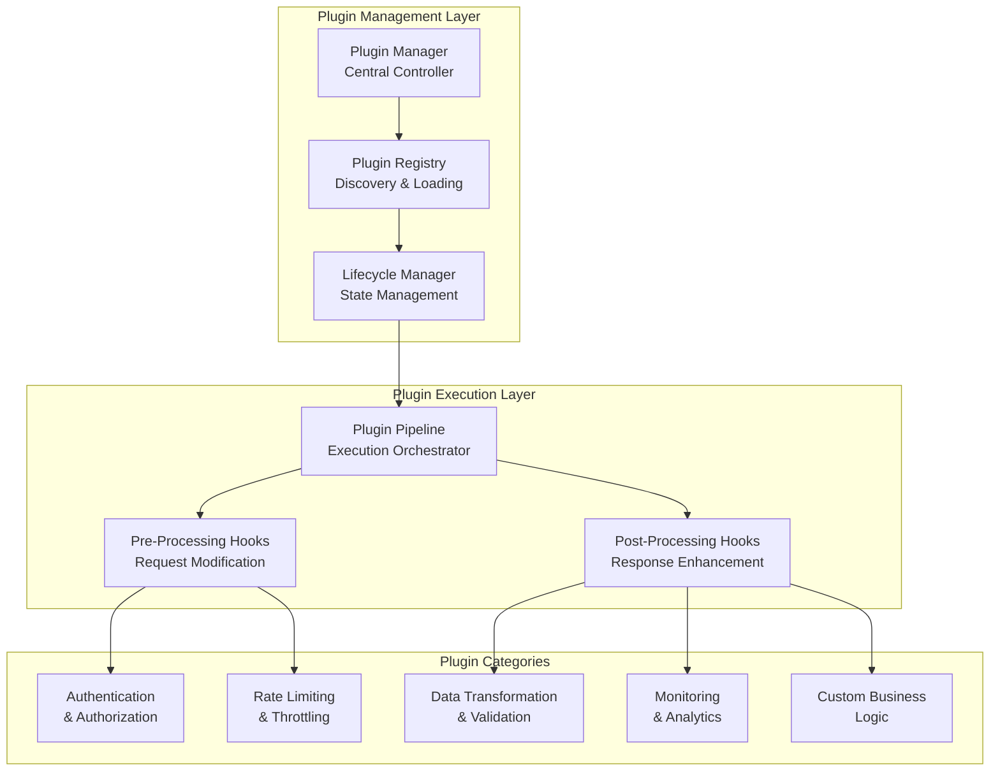
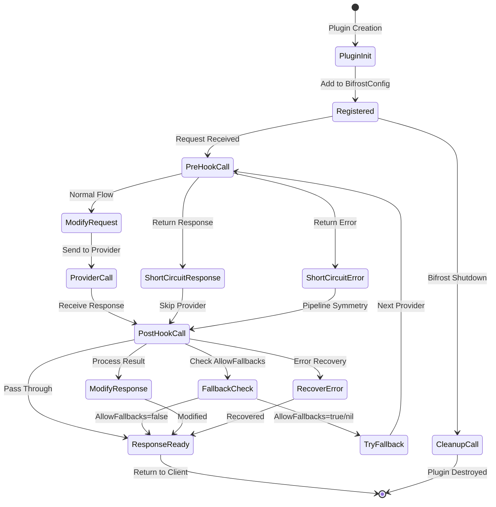
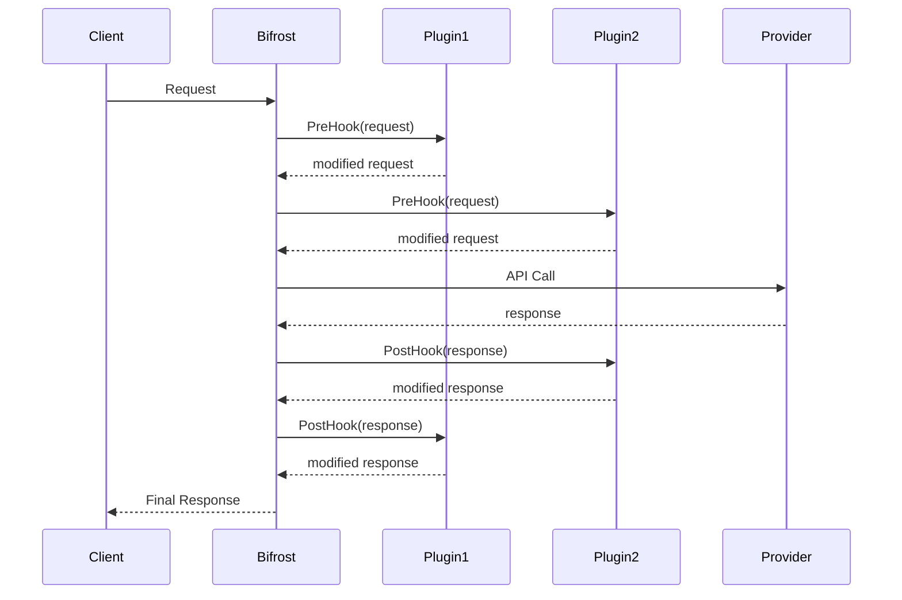
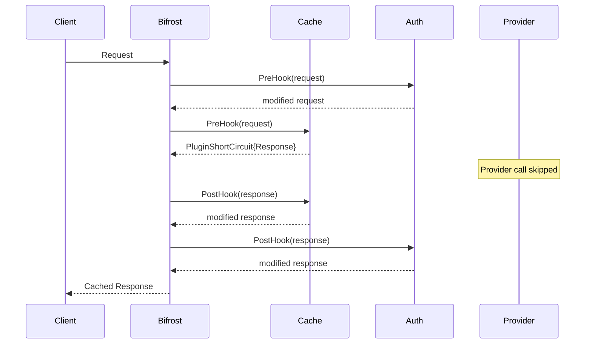
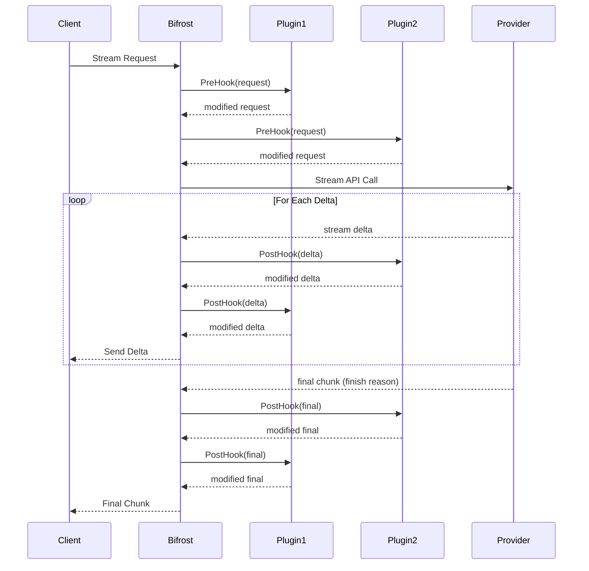
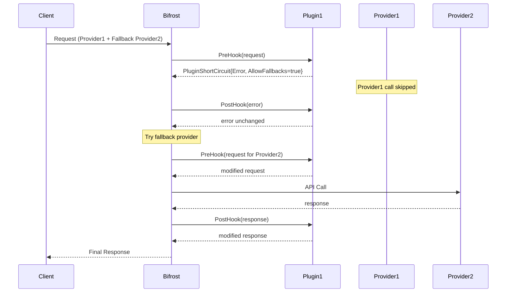
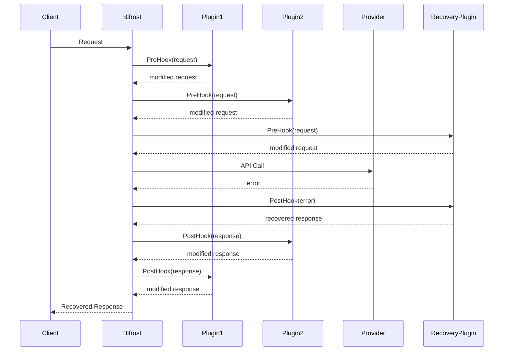
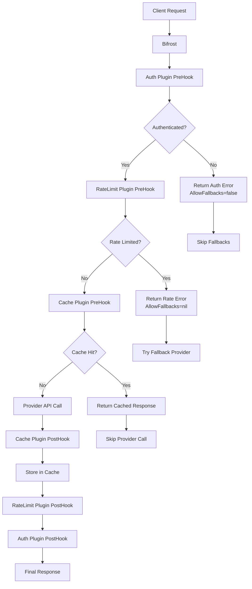
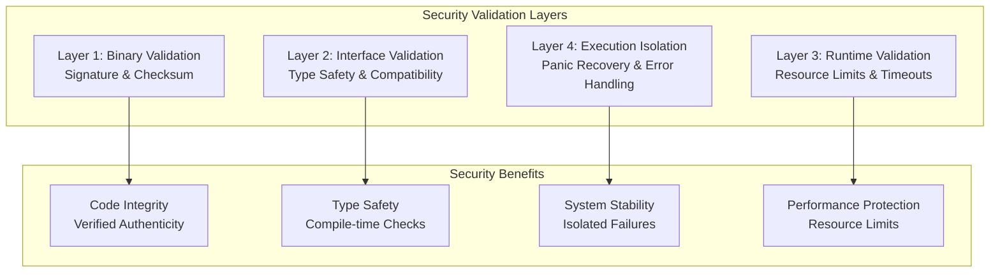
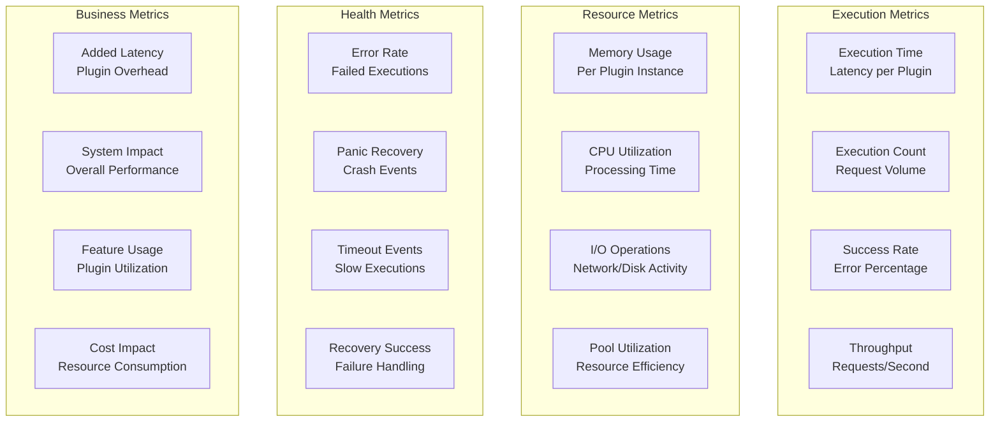

## Plugin Architecture Philosophy

### **Core Design Principles**

Bifrost's plugin system is built around five key principles that ensure extensibility without compromising performance or reliability:

| Principle                     | Implementation                                   | Benefit                                          |
| ----------------------------- | ------------------------------------------------ | ------------------------------------------------ |
| **Plugin-First Design**    | Core logic designed around plugin hook points    | Maximum extensibility without core modifications |
| **Zero-Copy Integration**  | Direct memory access to request/response objects | Minimal performance overhead                     |
| **Lifecycle Management**   | Complete plugin lifecycle with automatic cleanup | Resource safety and leak prevention              |
| **Interface-Based Safety** | Well-defined interfaces for type safety          | Compile-time validation and consistency          |
| **Failure Isolation**      | Plugin errors don't crash the core system        | Fault tolerance and system stability             |

### **Plugin System Overview**



---

## Plugin Lifecycle Management

### **Complete Lifecycle States**

Every plugin goes through a well-defined lifecycle that ensures proper resource management and error handling:



### **Lifecycle Phase Details**

**Discovery Phase:**

- **Purpose:** Find and catalog available plugins
- **Sources:** Command line, environment variables, JSON configuration, directory scanning
- **Validation:** Basic existence and format checks
- **Output:** Plugin descriptors with metadata

**Loading Phase:**

- **Purpose:** Load plugin binaries into memory
- **Security:** Digital signature verification and checksum validation
- **Compatibility:** Interface implementation validation
- **Resource:** Memory and capability assessment

**Initialization Phase:**

- **Purpose:** Configure plugin with runtime settings
- **Timeout:** Bounded initialization time to prevent hanging
- **Dependencies:** External service connectivity verification
- **State:** Internal state setup and resource allocation

**Runtime Phase:**

- **Purpose:** Active request processing
- **Monitoring:** Continuous health checking and performance tracking
- **Recovery:** Automatic error recovery and degraded mode handling
- **Metrics:** Real-time performance and health metrics collection

> **Plugin Lifecycle:** [Plugin Management →](../../enterprise/custom-plugins)

---

## Plugin Execution Pipeline

### **Request Processing Flow**

The plugin pipeline ensures consistent, predictable execution while maintaining high performance:

#### **Normal Execution Flow (No Short-Circuit)**



**Execution Order:**

1. **PreHooks:** Execute in registration order (1 → 2 → N)
2. **Provider Call:** If no short-circuit occurred
3. **PostHooks:** Execute in reverse order (N → 2 → 1)

#### **Short-Circuit Response Flow (Cache Hit)**



#### **Streaming Response Flow**

For streaming responses, the plugin pipeline executes post-hooks for every delta/chunk received from the provider:



**Streaming Execution Characteristics:**

1. **Delta Processing:**
   - Each stream delta (chunk) goes through all post-hooks
   - Plugins can modify/transform each delta before it reaches the client
   - Deltas can contain: text content, tool calls, role changes, or usage info

2. **Special Delta Types:**
   - **Start Event:** Initial delta with role information
   - **Content Delta:** Regular text or tool call content
   - **Usage Update:** Token usage statistics (if enabled)
   - **Final Chunk:** Contains finish reason and any final metadata

3. **Plugin Considerations:**
   - Plugins must handle streaming responses efficiently
   - Each delta should be processed quickly to maintain stream responsiveness
   - Plugins can track state across deltas using context
   - Heavy processing should be done asynchronously

4. **Error Handling:**
   - If a post-hook returns an error, it's sent as an error stream chunk
   - Stream is terminated after error chunks
   - Plugins can recover from errors by providing valid responses

5. **Performance Optimization:**
   - Lightweight delta processing to minimize latency
   - Object pooling for common data structures
   - Non-blocking operations for logging and metrics
   - Efficient memory management for stream processing

> **Streaming Details:** [Streaming Guide →](../../quickstart/gateway/streaming)

**Short-Circuit Rules:**

- **Provider Skipped:** When plugin returns short-circuit response/error
- **PostHook Guarantee:** All executed PreHooks get corresponding PostHook calls
- **Reverse Order:** PostHooks execute in reverse order of PreHooks

#### **Short-Circuit Error Flow (Allow Fallbacks)**



#### **Error Recovery Flow**



**Error Recovery Features:**

- **Error Transformation:** Plugins can convert errors to successful responses
- **Graceful Degradation:** Provide fallback responses for service failures
- **Context Preservation:** Error context is maintained through recovery process

### **Complex Plugin Decision Flow**

Real-world plugin interactions involving authentication, rate limiting, and caching with different decision paths:



### **Execution Characteristics**

**Symmetric Execution Pattern:**

- **Pre-processing:** Plugins execute in priority order (high to low)
- **Post-processing:** Plugins execute in reverse order (low to high)
- **Rationale:** Ensures proper cleanup and state management (last in, first out)

**Performance Optimizations:**

- **Timeout Boundaries:** Each plugin has configurable execution timeouts
- **Panic Recovery:** Plugin panics are caught and logged without crashing the system
- **Resource Limits:** Memory and CPU limits prevent runaway plugins
- **Circuit Breaking:** Repeated failures trigger plugin isolation

**Error Handling Strategies:**

- **Continue:** Use original request/response if plugin fails
- **Fail Fast:** Return error immediately if critical plugin fails
- **Retry:** Attempt plugin execution with exponential backoff
- **Fallback:** Use alternative plugin or default behavior

> **Plugin Execution:** [Request Flow →](./request-flow#stage-3-plugin-pipeline-processing)

---

## Plugin Discovery & Configuration

### **Configuration Methods**

**Current: Command-Line Plugin Loading**

```bash
# Docker deployment
docker run -p 8080:8080 \
  -e APP_PLUGINS="maxim,custom-plugin" \
  maximhq/bifrost

# NPM deployment
npx -y @maximhq/bifrost -plugins "maxim"
```

**Future: JSON Configuration System**

```json
{
  "plugins": [
    {
      "name": "maxim",
      "source": "../../plugins/maxim",
      "type": "local",
      "config": {
        "api_key": "env.MAXIM_API_KEY",
        "log_repo_id": "env.MAXIM_LOG_REPO_ID"
      }
    }
  ]
}
```

> **Plugin Configuration:** [Plugin Setup →](../../enterprise/custom-plugins)

---

## Security & Validation

### **Multi-Layer Security Model**

Plugin security operates at multiple layers to ensure system integrity:



### **Validation Process**

**Binary Security:**

- **Digital Signatures:** Cryptographic verification of plugin authenticity
- **Checksum Validation:** File integrity verification
- **Source Verification:** Trusted source requirements

**Interface Security:**

- **Type Safety:** Interface implementation verification
- **Version Compatibility:** Plugin API version checking
- **Memory Safety:** Safe memory access patterns

**Runtime Security:**

- **Resource Quotas:** Memory and CPU usage limits
- **Execution Timeouts:** Bounded execution time
- **Sandbox Execution:** Isolated execution environment

**Operational Security:**

- **Health Monitoring:** Continuous plugin health assessment
- **Error Tracking:** Plugin error rate monitoring
- **Automatic Recovery:** Failed plugin restart and recovery

---

## Plugin Performance & Monitoring

### **Comprehensive Metrics System**

Bifrost provides detailed metrics for plugin performance and health monitoring:



### **Performance Characteristics**

**Plugin Execution Performance:**

- **Typical Overhead:** 1-10μs per plugin for simple operations
- **Authentication Plugins:** 1-5μs for key validation
- **Rate Limiting Plugins:** 500ns for quota checks
- **Monitoring Plugins:** 200ns for metric collection
- **Transformation Plugins:** 2-10μs depending on complexity

**Resource Usage Patterns:**

- **Memory Efficiency:** Object pooling reduces allocations
- **CPU Optimization:** Minimal processing overhead
- **Network Impact:** Configurable external service calls
- **Storage Overhead:** Minimal for stateless plugins

---

## Plugin Integration Patterns

### **Common Integration Scenarios**

**1. Authentication & Authorization**

- **Pre-processing Hook:** Validate API keys or JWT tokens
- **Configuration:** External identity provider integration
- **Error Handling:** Return 401/403 responses for invalid credentials
- **Performance:** Sub-5μs validation with caching

**2. Rate Limiting & Quotas**

- **Pre-processing Hook:** Check request quotas and limits
- **Storage:** Redis or in-memory rate limit tracking
- **Algorithms:** Token bucket, sliding window, fixed window
- **Responses:** 429 Too Many Requests with retry headers

**3. Request/Response Transformation**

- **Dual Hooks:** Pre-processing for requests, post-processing for responses
- **Use Cases:** Data format conversion, field mapping, content filtering
- **Performance:** Streaming transformations for large payloads
- **Compatibility:** Provider-specific format adaptations

**4. Monitoring & Analytics**

- **Post-processing Hook:** Collect metrics and logs after request completion
- **Destinations:** Prometheus, DataDog, custom analytics systems
- **Data:** Request/response metadata, performance metrics, error tracking
- **Privacy:** Configurable data sanitization and filtering

### **Plugin Communication Patterns**

**Plugin-to-Plugin Communication:**

- **Shared Context:** Plugins can store data in request context for downstream plugins
- **Event System:** Plugin can emit events for other plugins to consume
- **Data Passing:** Structured data exchange between related plugins

**Plugin-to-External Service Communication:**

- **HTTP Clients:** Built-in HTTP client pools for external API calls
- **Database Connections:** Connection pooling for database access
- **Message Queues:** Integration with message queue systems
- **Caching Systems:** Redis, Memcached integration for state storage

> **📖 Integration Examples:** [Plugin Development Guide →](../../enterprise/custom-plugins)

---

## Related Architecture Documentation

- **[Request Flow](./request-flow)** - Plugin execution in request processing pipeline
- **[Concurrency Model](./concurrency)** - Plugin concurrency and threading considerations
- **[Benchmarks](../../benchmarking/getting-started)** - Plugin performance characteristics and optimization
- **[MCP System](./mcp)** - Integration between plugins and MCP system

