## Stage 1: Transport Layer Processing

### **HTTP Transport Flow**

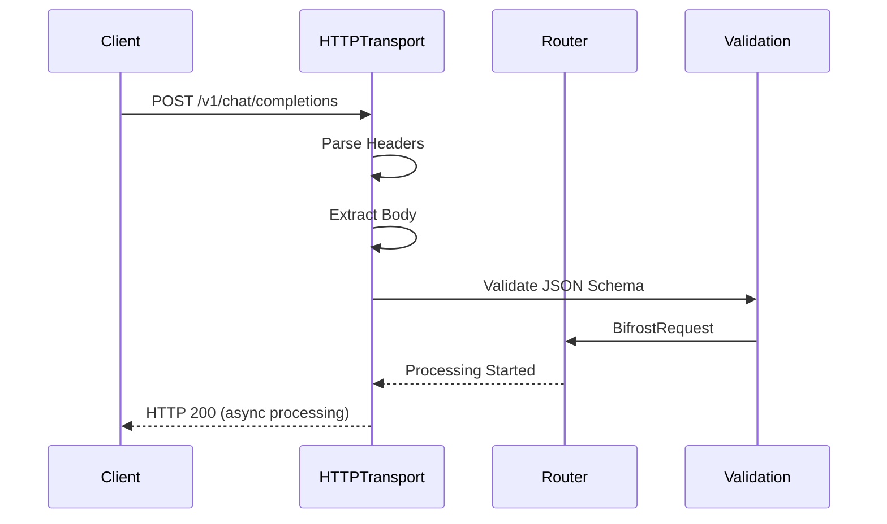

**Key Processing Steps:**

1. **Request Reception** - FastHTTP server receives request
2. **Header Processing** - Extract authentication, content-type, custom headers
3. **Body Parsing** - JSON unmarshaling with schema validation
4. **Request Transformation** - Convert to internal `BifrostRequest` schema
5. **Context Creation** - Build request context with metadata

**Performance Characteristics:**

- **Parsing Time:** ~2.1μs for typical requests
- **Validation Overhead:** ~400ns for schema checks
- **Memory Allocation:** Zero-copy where possible

### **Go SDK Flow**

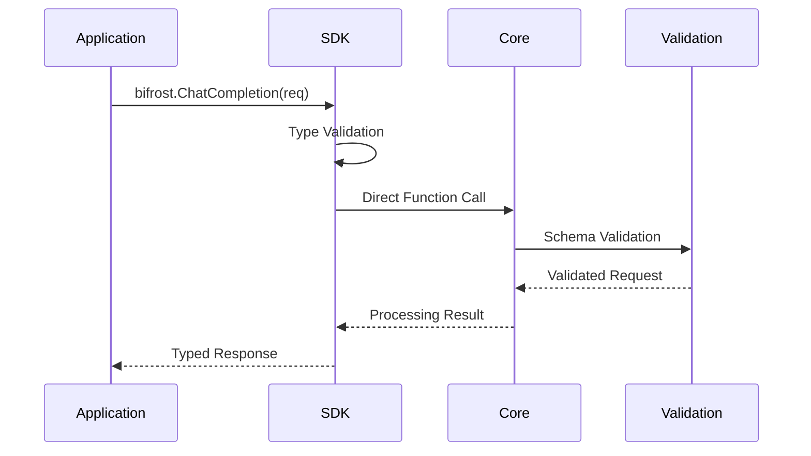

**Advantages:**

- **Zero Serialization** - Direct Go struct passing
- **Type Safety** - Compile-time validation
- **Lower Latency** - No HTTP/JSON overhead
- **Memory Efficiency** - No intermediate allocations

---

## Stage 2: Request Routing & Load Balancing

### **Provider Selection Logic**

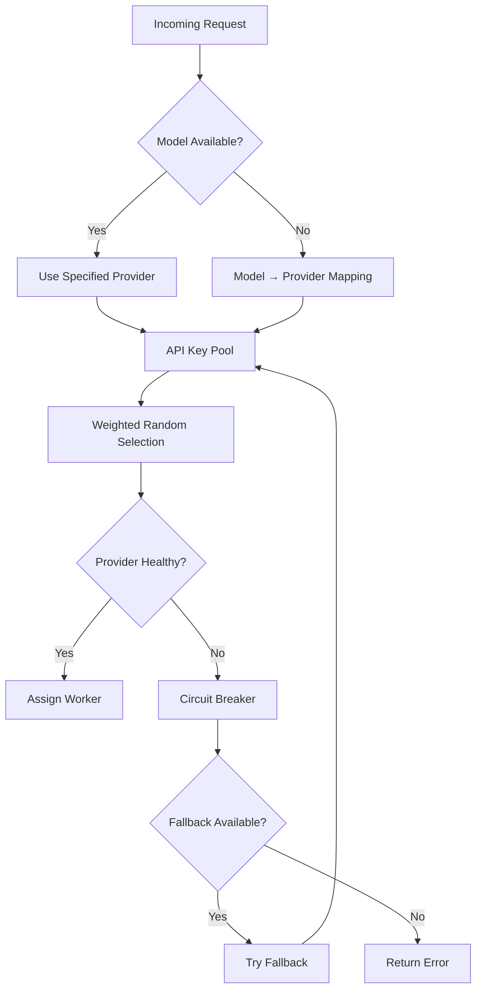

**Key Selection Algorithm:**

```go
// Weighted random key selection
type KeySelector struct {
    keys    []APIKey
    weights []float64
    total   float64
}

func (ks *KeySelector) SelectKey() *APIKey {
    r := rand.Float64() * ks.total
    cumulative := 0.0

    for i, weight := range ks.weights {
        cumulative += weight
        if r <= cumulative {
            return &ks.keys[i]
        }
    }
    return &ks.keys[len(ks.keys)-1]
}
```

**Performance Metrics:**

- **Key Selection Time:** ~10ns (constant time)
- **Health Check Overhead:** ~50ns (cached results)
- **Fallback Decision:** ~25ns (configuration lookup)

---

## Stage 3: Plugin Pipeline Processing

### **Pre-Processing Hooks**

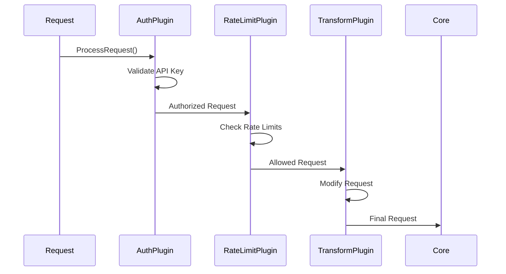

**Plugin Execution Model:**

```go
type PluginManager struct {
    plugins []Plugin
}

func (pm *PluginManager) ExecutePreHooks(
    ctx BifrostContext,
    req *BifrostRequest,
) (*BifrostRequest, *BifrostError) {
    for _, plugin := range pm.plugins {
        modifiedReq, err := plugin.ProcessRequest(ctx, req)
        if err != nil {
            return nil, err
        }
        req = modifiedReq
    }
    return req, nil
}
```

**Plugin Types & Performance:**

| Plugin Type           | Processing Time | Memory Impact | Failure Mode           |
| --------------------- | --------------- | ------------- | ---------------------- |
| **Authentication**    | ~1-5μs          | Minimal       | Reject request         |
| **Rate Limiting**     | ~500ns          | Cache-based   | Throttle/reject        |
| **Request Transform** | ~2-10μs         | Copy-on-write | Continue with original |
| **Monitoring**        | ~200ns          | Append-only   | Continue silently      |

---

## Stage 4: MCP Tool Discovery & Integration

### **Tool Discovery Process**

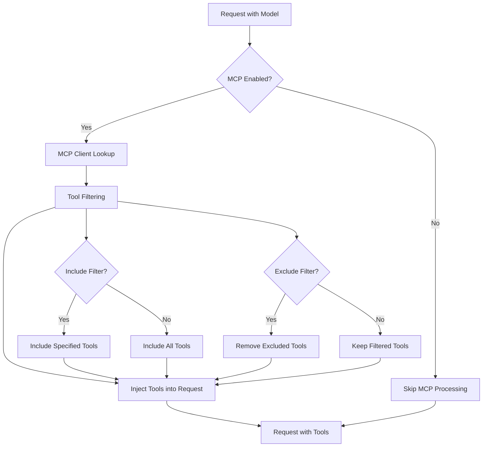

**Tool Integration Algorithm:**

```go
func (mcpm *MCPManager) EnhanceRequest(
    ctx BifrostContext,
    req *BifrostRequest,
) (*BifrostRequest, error) {
    // Extract tool filtering from context
    includeClients := ctx.GetStringSlice("mcp-include-clients")
    excludeClients := ctx.GetStringSlice("mcp-exclude-clients")
    includeTools := ctx.GetStringSlice("mcp-include-tools")
    excludeTools := ctx.GetStringSlice("mcp-exclude-tools")

    // Get available tools
    availableTools := mcpm.getAvailableTools(includeClients, excludeClients)

    // Filter tools
    filteredTools := mcpm.filterTools(availableTools, includeTools, excludeTools)

    // Inject into request
    if req.Params == nil {
        req.Params = &ModelParameters{}
    }
    req.Params.Tools = append(req.Params.Tools, filteredTools...)

    return req, nil
}
```

**MCP Performance Impact:**

- **Tool Discovery:** ~100-500μs (cached after first request)
- **Tool Filtering:** ~50-200ns per tool
- **Request Enhancement:** ~1-5μs depending on tool count

---

## Stage 5: Memory Pool Management

### **Object Pool Lifecycle**

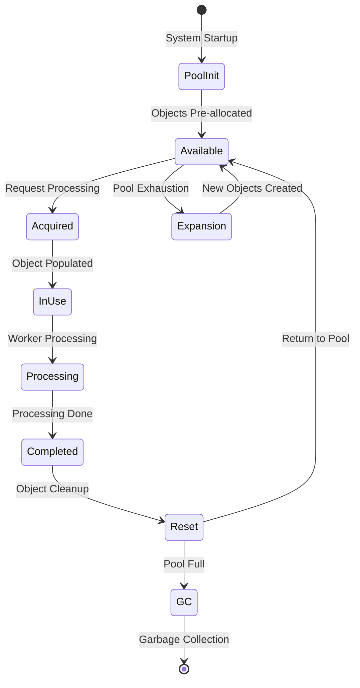

**Memory Pool Implementation:**

```go
type MemoryPools struct {
    channelPool  sync.Pool
    messagePool  sync.Pool
    responsePool sync.Pool
    bufferPool   sync.Pool
}

func (mp *MemoryPools) GetChannel() *ProcessingChannel {
    if ch := mp.channelPool.Get(); ch != nil {
        return ch.(*ProcessingChannel)
    }
    return NewProcessingChannel()
}

func (mp *MemoryPools) ReturnChannel(ch *ProcessingChannel) {
    ch.Reset() // Clear previous data
    mp.channelPool.Put(ch)
}
```

---

## Stage 6: Worker Pool Processing

### **Worker Assignment & Execution**

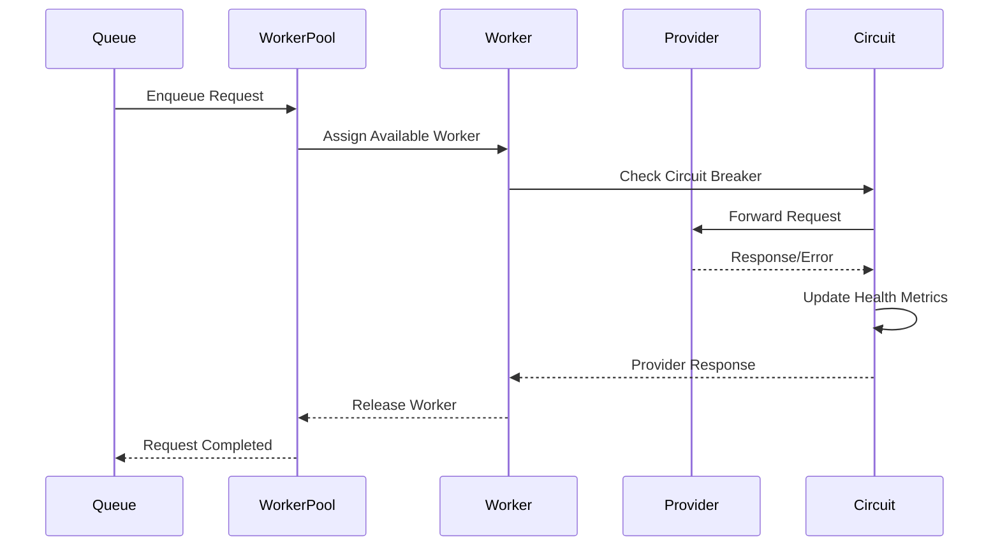

**Worker Pool Architecture:**

```go
type ProviderWorkerPool struct {
    workers    chan *Worker
    queue      chan *ProcessingJob
    config     WorkerPoolConfig
    metrics    *PoolMetrics
}

func (pwp *ProviderWorkerPool) ProcessRequest(job *ProcessingJob) {
    // Get worker from pool
    worker := <-pwp.workers

    go func() {
        defer func() {
            // Return worker to pool
            pwp.workers <- worker
        }()

        // Process request
        result := worker.Execute(job)
        job.ResultChan <- result
    }()
}
```

---

## Stage 7: Provider API Communication

### **HTTP Request Execution**

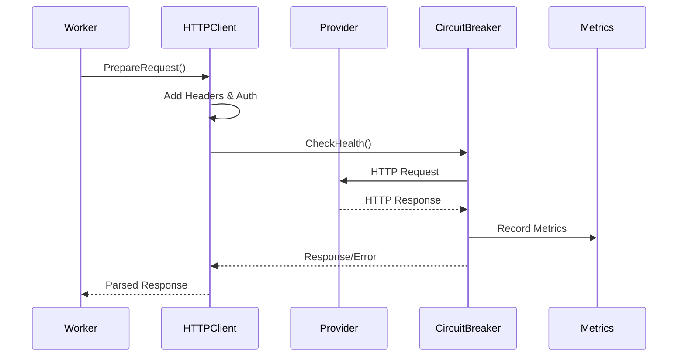

**Request Preparation Pipeline:**

```go
func (w *ProviderWorker) ExecuteRequest(job *ProcessingJob) *ProviderResponse {
    // Prepare HTTP request
    httpReq := w.prepareHTTPRequest(job.Request)

    // Add authentication
    w.addAuthentication(httpReq, job.APIKey)

    // Execute with timeout
    ctx, cancel := context.WithTimeout(context.Background(), job.Timeout)
    defer cancel()

    httpResp, err := w.httpClient.Do(httpReq.WithContext(ctx))
    if err != nil {
        return w.handleError(err, job)
    }

    // Parse response
    return w.parseResponse(httpResp, job)
}
```

---

## Stage 8: Tool Execution & Response Processing

### **MCP Tool Execution Flow**

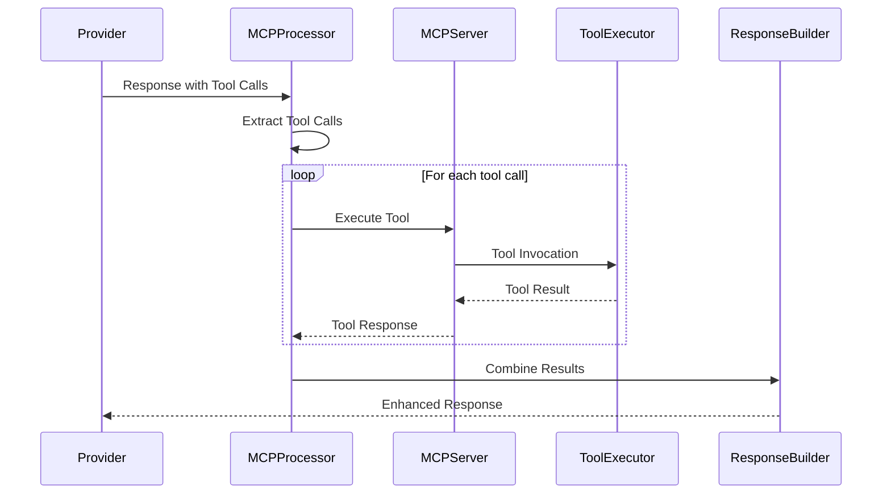

**Tool Execution Pipeline:**

```go
func (mcp *MCPProcessor) ProcessToolCalls(
    response *ProviderResponse,
) (*ProviderResponse, error) {
    toolCalls := mcp.extractToolCalls(response)
    if len(toolCalls) == 0 {
        return response, nil
    }

    // Execute tools concurrently
    results := make(chan ToolResult, len(toolCalls))
    for _, toolCall := range toolCalls {
        go func(tc ToolCall) {
            result := mcp.executeTool(tc)
            results <- result
        }(toolCall)
    }

    // Collect results
    toolResults := make([]ToolResult, 0, len(toolCalls))
    for i := 0; i < len(toolCalls); i++ {
        toolResults = append(toolResults, <-results)
    }

    // Enhance response
    return mcp.enhanceResponse(response, toolResults), nil
}
```

---

## Stage 9: Post-Processing & Response Formation

### **Plugin Post-Processing**

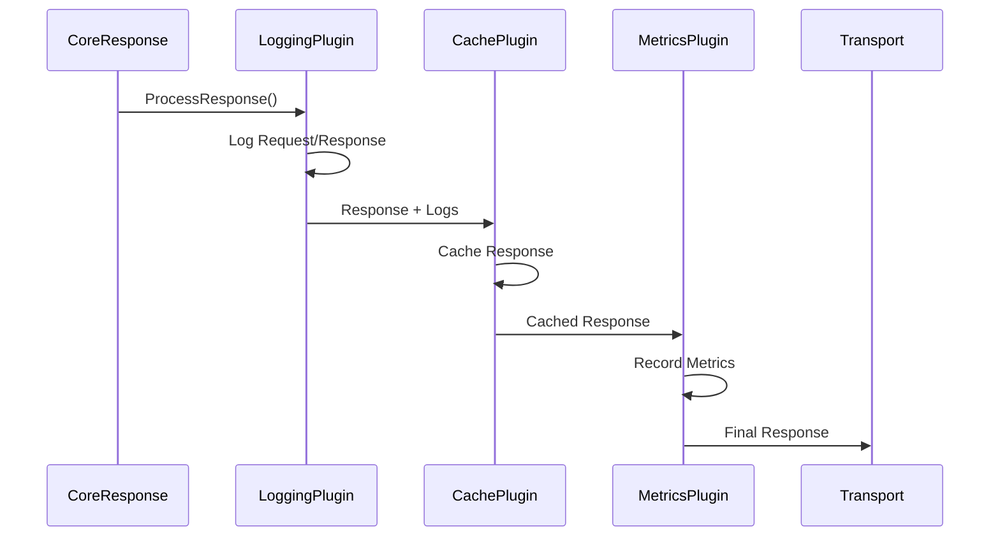

**Response Enhancement Pipeline:**

```go
func (pm *PluginManager) ExecutePostHooks(
    ctx BifrostContext,
    req *BifrostRequest,
    resp *BifrostResponse,
) (*BifrostResponse, error) {
    for _, plugin := range pm.plugins {
        enhancedResp, err := plugin.ProcessResponse(ctx, req, resp)
        if err != nil {
            // Log error but continue processing
            pm.logger.Warn("Plugin post-processing error", "plugin", plugin.Name(), "error", err)
            continue
        }
        resp = enhancedResp
    }
    return resp, nil
}
```

### **Response Serialization**

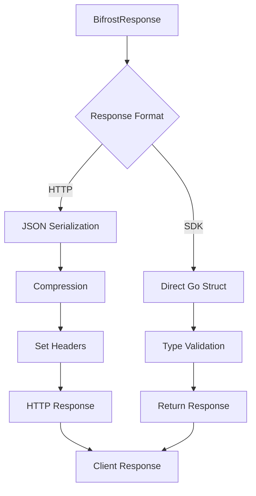

---

## Related Architecture Documentation

- **[Concurrency Model](./concurrency)** - Worker pools and threading details
- **[Plugin System](./plugins)** - Plugin execution and lifecycle
- **[MCP System](./mcp)** - Tool discovery and execution internals
- **[Benchmarks](../../benchmarking/getting-started)** - Detailed performance analysis
