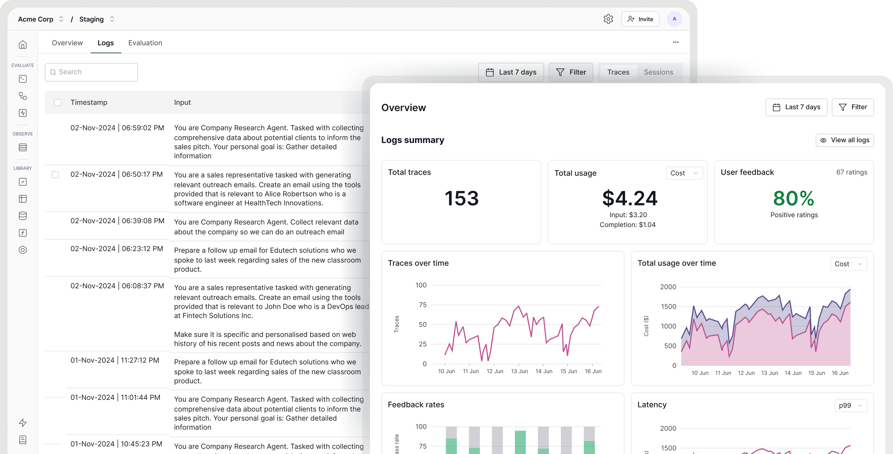

## Overview

Bifrost provides comprehensive LLM observability through the **Maxim plugin**, enabling seamless tracking, evaluation, and analysis of AI interactions. The plugin automatically forwards all LLM requests and responses to Maxim's platform for detailed monitoring and performance insights.



---

## Setup

The Maxim plugin enables seamless observability and evaluation of LLM interactions by forwarding inputs/outputs to Maxim's platform:

<Tabs group="setup-method">
<Tab title="Go SDK">

```go
package main

import (
    "context"
    bifrost "github.com/maximhq/bifrost/core"
    "github.com/maximhq/bifrost/core/schemas"
    maxim "github.com/maximhq/bifrost/plugins/maxim"
)

func main() {
    // Initialize Maxim plugin
    maximPlugin, err := maxim.Init(maxim.Config{
        ApiKey:    "your_maxim_api_key",
        LogRepoId: "your_default_repo_id", // Optional: fallback repository
    })
    if err != nil {
        panic(err)
    }

    // Initialize Bifrost with the plugin
    client, err := bifrost.Init(context.Background(), schemas.BifrostConfig{
        Account: &yourAccount,
        Plugins: []schemas.Plugin{maximPlugin},
    })
    if err != nil {
        panic(err)
    }
    defer client.Shutdown()

    // All requests will now be traced to Maxim
}
```

</Tab>
<Tab title="config.json">

For HTTP transport, configure via environment variables:

```json
{
  "plugins": [
    {
      "enabled": true,
      "name": "maxim",
      "config": {        
        "api_key": "your_maxim_api_key",
        "log_repo_id": "your_default_repo_id"
      }
    }
  ]
}
```

</Tab>
</Tabs>

## Configuration

| Field | Type | Required | Description |
|-------|------|----------|-------------|
| `ApiKey` | `string` | ✅ Yes | Your Maxim API key for authentication |
| `LogRepoId` | `string` | ❌ No | Default log repository ID (can be overridden per request) |

## Repository Selection

The plugin uses repository selection with the following priority:

1. **Header/Context Repository** - Highest priority
2. **Default Repository** (from plugin config) - Fallback
3. **Skip Logging** - If neither is available

<Tabs group="repository-selection"  >
<Tab title="Go SDK">

```go
ctx := context.Background()

// Use specific repository for this request
ctx = context.WithValue(ctx, maxim.LogRepoIDKey, "project-specific-repo")
```

</Tab>
<Tab title="Gateway"> 

```bash
# Use default repository (from config)
curl -X POST http://localhost:8080/v1/chat/completions \
  -d '{"model": "gpt-4", "messages": [...]}'

# Override with specific repository
curl -X POST http://localhost:8080/v1/chat/completions \
  -H "x-bf-maxim-log-repo-id: project-specific-repo" \
  -d '{"model": "gpt-4", "messages": [...]}'
```

</Tab>
</Tabs>


## Custom Trace Management

### Trace Propagation

The plugin supports custom session, trace, and generation IDs for advanced tracing scenarios:

<Tabs group="trace-propagation">
<Tab title="Go SDK">
```go
ctx := context.Background()

// Prefer typed keys from the Maxim plugin
ctx = context.WithValue(ctx, maxim.TraceIDKey, "custom-trace-123")
ctx = context.WithValue(ctx, maxim.GenerationIDKey, "custom-gen-456")
ctx = context.WithValue(ctx, maxim.SessionIDKey, "user-session-789")

// Optionally set human-friendly names
ctx = context.WithValue(ctx, maxim.TraceNameKey, "checkout-flow")
ctx = context.WithValue(ctx, maxim.GenerationNameKey, "rerank-step")
```
</Tab>
<Tab title="Gateway">
```bash
curl -X POST http://localhost:8080/v1/chat/completions \
  -H "x-bf-maxim-trace-id: custom-trace-123" \
  -H "x-bf-maxim-generation-id: custom-gen-456" \
  -H "x-bf-maxim-session-id: user-session-789" \
  -H "x-bf-maxim-trace-name: checkout-flow" \
  -H "x-bf-maxim-generation-name: rerank-step" \
  -d '{"model": "gpt-4", "messages": [...]}'
```
</Tab>
</Tabs>

### Custom Tags

You can add custom tags to traces for enhanced filtering and analytics:

<Tabs group="custom-tags">
<Tab title="Go SDK">

```go
ctx := context.Background()

// Pass arbitrary tag key-values via context map
tags := map[string]string{
    "environment":  "production",
    "user-id":      "user-123",
    "feature-flag": "new-ui",
}
ctx = context.WithValue(ctx, maxim.TagsKey, tags)
```

</Tab>
<Tab title="Gateway">

```bash
curl -X POST http://localhost:8080/v1/chat/completions \
  -H "x-bf-maxim-environment: production" \
  -H "x-bf-maxim-user-id: user-123" \
  -H "x-bf-maxim-feature-flag: new-ui" \
  -d '{"model": "gpt-4", "messages": [...]}'
```

Reserved keys are `session-id`, `trace-id`, `trace-name`, `generation-id`, `generation-name`, `log-repo-id`. All other `x-bf-maxim-*` headers are treated as tags.

</Tab>
</Tabs>

## Supported Request Types

The plugin supports the following Bifrost request types:

- Text Completion
- Chat Completion

## Monitoring & Analytics

Once configured, monitor your AI apps in the [Maxim Dashboard](https://getmaxim.ai/). Maxim is an end-to-end evaluation & observability platform built to help teams ship AI agents faster while maintaining high quality.

* **Experiment / Prompt Engineering**
  Playground++ for prompt design: versioning, comparison (A/B), visual chaining, low-code tooling.

* **Simulation & Evaluation**
  Test agents over thousands of scenarios, both automated (statistical, programmatic) and human-in-the-loop for edge cases. Custom and off-the-shelf evaluators.

* **Observability / Monitoring**
  Real-time traces, logging, debugging of multi-agent workflows, live issue tracking, alerts when quality or performance degrade.

* **Data Engine & Dataset Management**
  Support for multi-modal datasets, import & continuous curation, feedback/annotation pipelines, data splitting for experiments.

* **Governance, Security & Compliance**
  Features like SOC 2 Type II compliance, enterprise security controls, permissions, auditability.

* **Alerts & SLAs**: Threshold-based notifications to keep quality and latency in guardrails

## Next Steps

Now that you have observability set up with the Maxim plugin, explore these related topics:

- **[Tracing](./tracing)** - Deep-dive into request/response logging and correlation
- **[Telemetry](./telemetry)** - Prometheus metrics, dashboards, and alerting
- **[Governance](./governance)** - Virtual keys, per-team controls, and usage limits
