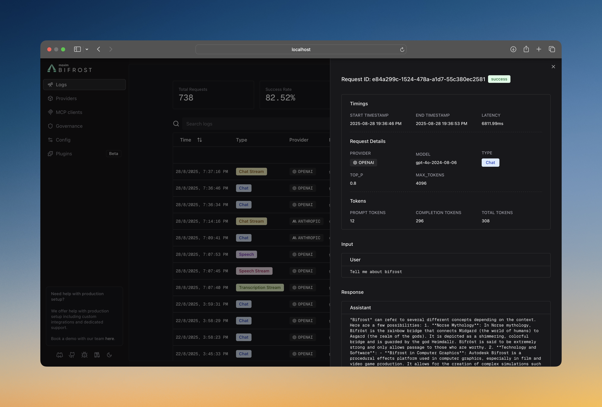
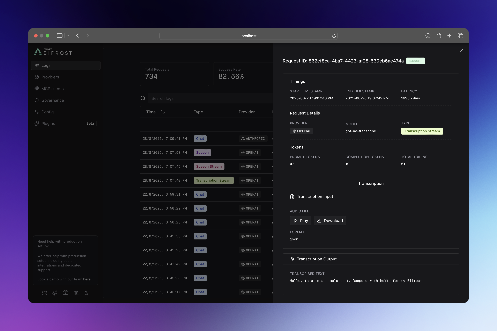
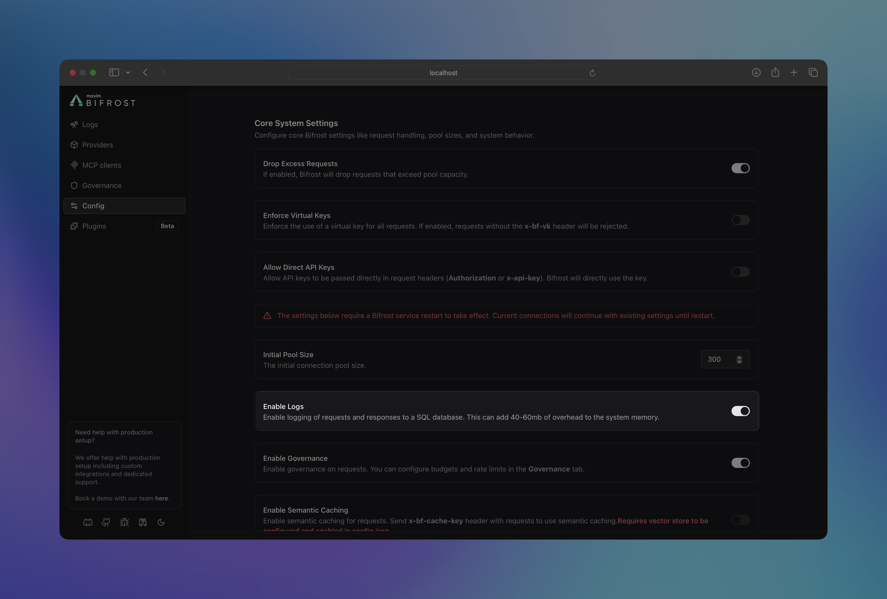

## Overview

**Tracing** is a powerful Bifrost Gateway feature that automatically captures and stores detailed information about every AI request and response that flows through your system. This includes complete request/response cycles, performance metrics, error details, and provider-specific metadata.

Unlike basic logging, Bifrost's tracing system provides structured, searchable data with real-time monitoring capabilities, making it easy to debug issues, analyze performance patterns, and understand your AI application's behavior at scale.


## How It Works

Bifrost traces comprehensive information for every request:



### **Request Data**
- **Input Messages**: Complete conversation history and user prompts
- **Model Parameters**: Temperature, max tokens, tools, and all other parameters
- **Provider Context**: Which provider and model handled the request

### **Response Data**
- **Output Messages**: AI responses, tool calls, and function results
- **Performance Metrics**: Latency and token usage
- **Status Information**: Success or error details

### **Multimodal Support**
- **Audio Processing**: Speech synthesis and transcription inputs/outputs
- **Vision Analysis**: Image URLs and vision model responses
- **Tool Execution**: Function calling arguments and results



All data is automatically captured without any changes to your application code.

---

## Configuration

Configure request tracing to control what gets logged and where it's stored:

<Tabs group="tracing-config">

<Tab title="Using Web UI">



1. Navigate to **http://localhost:8080**
2. Go to **"Settings"**
3. Toggle **"Enable Logs"** 

</Tab>

<Tab title="Using API">

**Enable/Disable Tracing:**
```bash
curl --location 'http://localhost:8080/api/config' \
--header 'Content-Type: application/json' \
--method PUT \
--data '{
    "enable_logging": true,
    "drop_excess_requests": false,
    "initial_pool_size": 300,
    "enable_governance": true,
    "enforce_governance_header": false,
    "allow_direct_keys": false,
    "prometheus_labels": [],
    "allowed_origins": []
}'
```

**Check Current Configuration:**
```bash
curl --location 'http://localhost:8080/api/config'
```

**Response includes tracing status:**
```json
{
    "client_config": {
        "enable_logging": true,
        "drop_excess_requests": false
    },
    "is_db_connected": true,
    "is_cache_connected": true, 
    "is_logs_connected": true
}
```

</Tab>

<Tab title="Using config.json">

```json
{
    "client": {
        "enable_logging": true,
        "drop_excess_requests": false,
        "initial_pool_size": 300,
        "enable_governance": true,
        "allow_direct_keys": false
    },
    "logs_store": {
        "enabled": true,
        "type": "sqlite",
        "config": {
            "path": "./logs.db"
        }
    }
}
```

**Configuration Options:**
- **`enable_logging`**: Master toggle for request tracing
- **`logs_store.enabled`**: Enable persistent log storage
- **`logs_store.type`**: Database type (currently `sqlite`)
- **`logs_store.config.path`**: Database file path

</Tab>

</Tabs>

---

## Advanced Filtering

Retrieve and analyze logs with powerful filtering capabilities:


### **API Filtering Options**

```bash
curl 'http://localhost:8080/api/logs?' \
'providers=openai,anthropic&' \
'models=gpt-4o-mini&' \
'status=success,error&' \
'start_time=2024-01-15T00:00:00Z&' \
'end_time=2024-01-15T23:59:59Z&' \
'min_latency=1000&' \
'max_latency=5000&' \
'min_tokens=10&' \
'max_tokens=1000&' \
'min_cost=0.001&' \
'max_cost=10&' \
'content_search=python&' \
'limit=100&' \
'offset=0'
```

### **Available Filters**

| Filter | Description | Example |
|--------|-------------|---------|
| `providers` | Filter by AI providers | `openai,anthropic` |
| `models` | Filter by specific models | `gpt-4o-mini,claude-3-sonnet` |
| `status` | Request status | `success,error,processing` |
| `objects` | Request types | `chat.completion,embedding` |
| `start_time` / `end_time` | Time range (RFC3339) | `2024-01-15T10:00:00Z` |
| `min_latency` / `max_latency` | Response time (ms) | `1000` to `5000` |
| `min_tokens` / `max_tokens` | Token usage range | `10` to `1000` |
| `min_cost` / `max_cost` | Cost range (USD) | `0.001` to `10` |
| `content_search` | Search in messages | `"error handling"` |
| `limit` / `offset` | Pagination | `100`, `200` |

### **Response Format**

```json
{
    "logs": [...],
    "total_count": 1234,
    "has_more": true,
    "filters_applied": {
        "providers": ["openai"],
        "status": ["success"]
    }
}
```

Perfect for analytics, debugging specific issues, or building custom monitoring dashboards.

---

## Log Store Options

Choose the right storage backend for your scale and requirements:

### **Current Support**

**SQLite** (Default)
- **Best for**: Development, small-medium deployments
- **Performance**: Excellent for read-heavy workloads
- **Setup**: Zero configuration, single file storage
- **Limits**: Single-writer, local filesystem only

```json
{
    "logs_store": {
        "enabled": true,
        "type": "sqlite",
        "config": {
            "path": "./logs.db"
        }
    }
}
```

### **Planned Support**

**PostgreSQL** (Coming Soon)
- **Best for**: High-volume production deployments
- **Performance**: Excellent concurrent writes and complex queries
- **Features**: Advanced indexing, partitioning, replication

**MySQL** (Coming Soon)
- **Best for**: Traditional MySQL environments
- **Performance**: Good balance of features and performance
- **Features**: Familiar ecosystem, wide tooling support

**ClickHouse** (Coming Soon)
- **Best for**: Analytics and time-series workloads
- **Performance**: Exceptional for large-scale log analysis
- **Features**: Columnar storage, compression, real-time analytics

{/* **To understand how the tracing plugin handles everything concurrently without increasing latency while maintaining best performance, check the [Tracing Architecture Guide](../architecture/plugins/tracing).** */}

---

## Next Steps

{/* - **[Architecture Deep Dive](../architecture/plugins/tracing)** - Internal implementation and performance tuning */}
- **[Observability](./observability)** - Metrics, monitoring, and alerting setup
- **[Gateway Setup](../quickstart/gateway/setting-up)** - Get Bifrost running with tracing enabled
- **[Provider Configuration](../quickstart/gateway/provider-configuration)** - Configure multiple providers for better insights