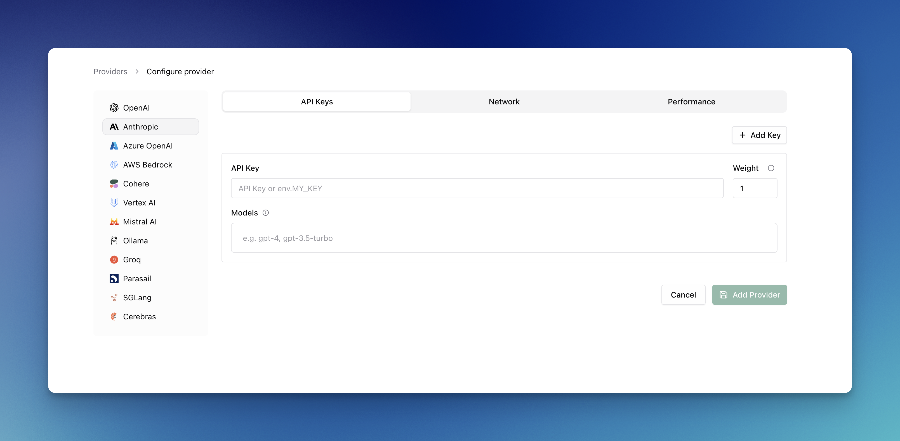
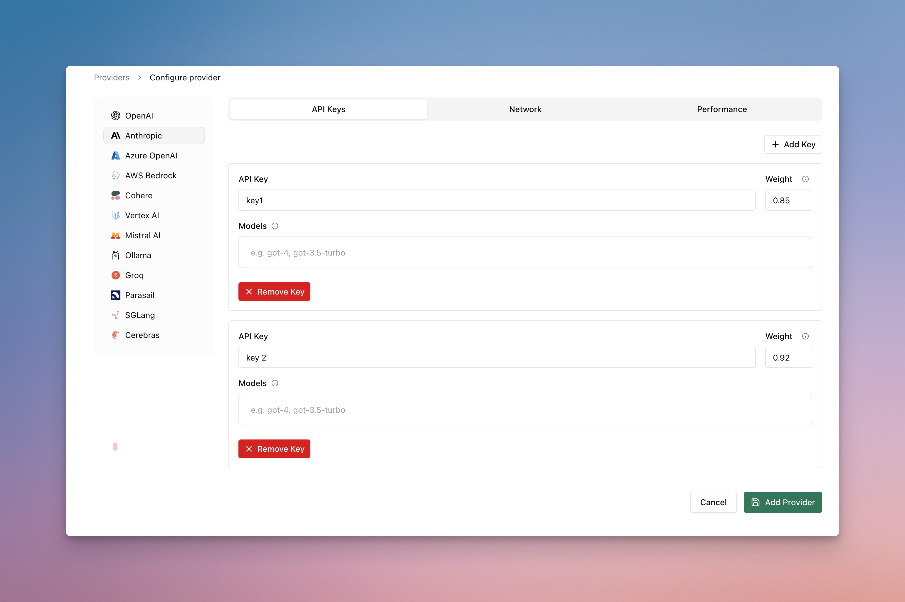
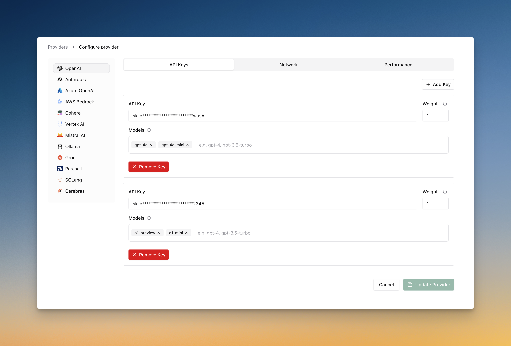
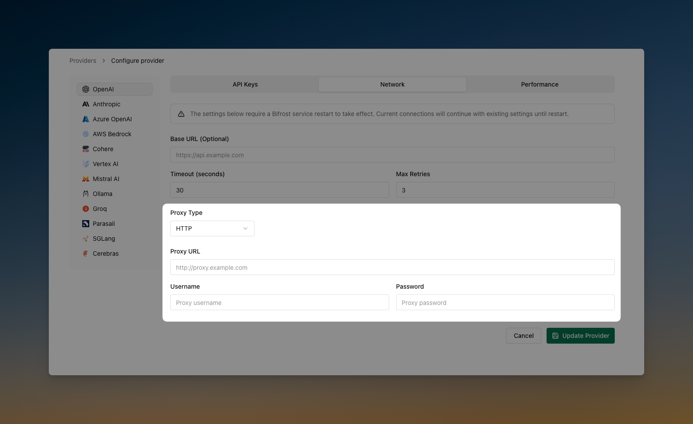
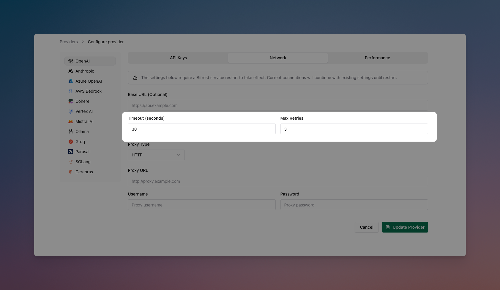
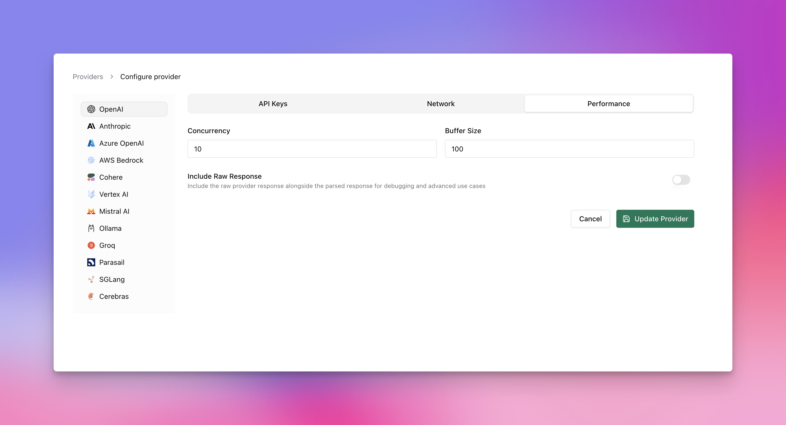
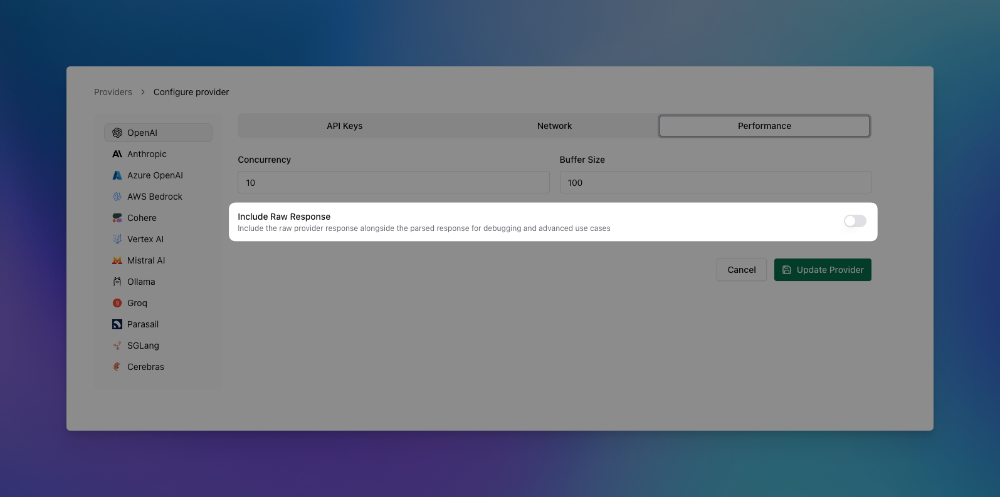
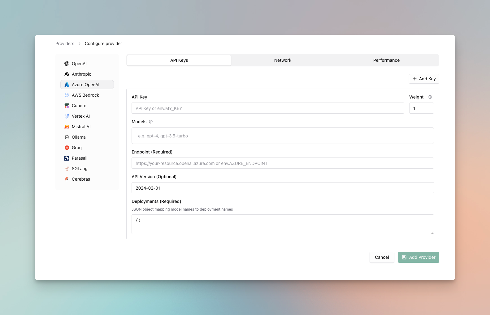
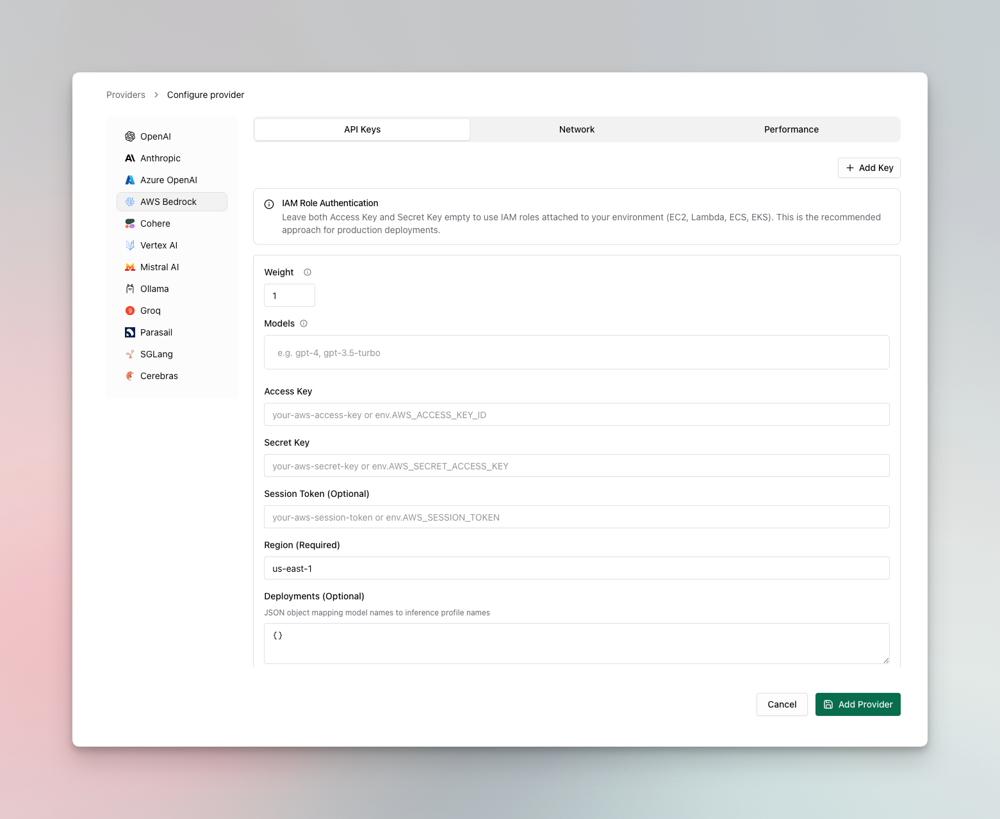
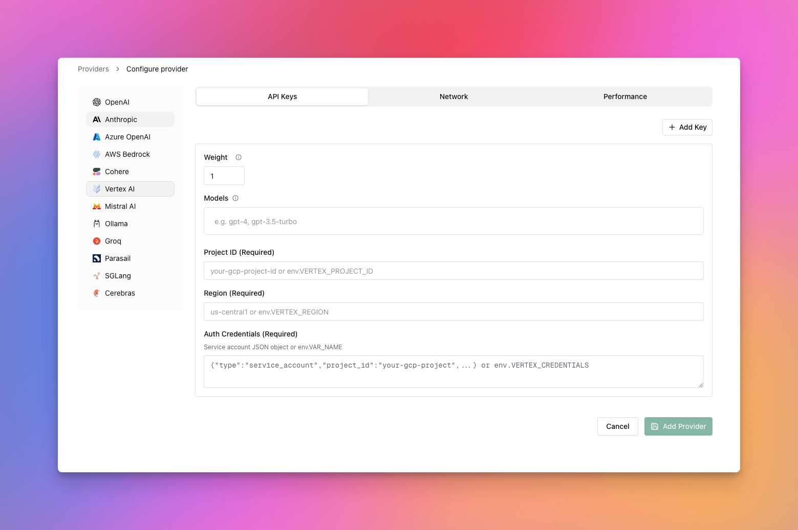

## Multi-Provider Setup

Configure multiple providers to seamlessly switch between them. This example shows how to configure OpenAI, Anthropic, and Mistral providers.

<Tabs group="provider-config">

<Tab title="Using Web UI">



1. Go to **http://localhost:8080**
2. Navigate to **"Providers"** in the sidebar
3. Click **"Add Provider"**
4. Select provider and configure keys
5. Save configuration

</Tab>

<Tab title="Using API">

```bash
# Add OpenAI provider
curl --location 'http://localhost:8080/api/providers' \
--header 'Content-Type: application/json' \
--data '{
    "provider": "openai",
    "keys": [
        {
            "value": "env.OPENAI_API_KEY",
            "models": [],
            "weight": 1.0
        }
    ]
}'

# Add Anthropic provider
curl --location 'http://localhost:8080/api/providers' \
--header 'Content-Type: application/json' \
--data '{
    "provider": "anthropic",
    "keys": [
        {
            "value": "env.ANTHROPIC_API_KEY",
            "models": [],
            "weight": 1.0
        }
    ]
}'
```

</Tab>

<Tab title="Using config.json">

```json
{
    "providers": {
        "openai": {
            "keys": [
                {
                    "value": "env.OPENAI_API_KEY",
                    "models": [],
                    "weight": 1.0
                }
            ]
        },
        "anthropic": {
            "keys": [
                {
                    "value": "env.ANTHROPIC_API_KEY",
                    "models": [],
                    "weight": 1.0
                }
            ]
        }
    }
}
```

</Tab>

</Tabs>

## Making Requests

Once providers are configured, you can make requests to any specific provider. This example shows how to send a request directly to OpenAI's GPT-4o Mini model. Bifrost handles the provider-specific API formatting automatically.

```bash
curl --location 'http://localhost:8080/v1/chat/completions' \
--header 'Content-Type: application/json' \
--data '{
    "model": "openai/gpt-4o-mini",
    "messages": [
        {"role": "user", "content": "Hello!"}
    ]
}'
```

## Environment Variables

Set up your API keys for the providers you want to use. Bifrost supports both direct key values and environment variable references with the `env.` prefix:

```bash
export OPENAI_API_KEY="your-openai-api-key"
export ANTHROPIC_API_KEY="your-anthropic-api-key"
export MISTRAL_API_KEY="your-mistral-api-key"
export GROQ_API_KEY="your-groq-api-key"
export COHERE_API_KEY="your-cohere-api-key"
```

**Environment Variable Handling:**
- Use `"value": "env.VARIABLE_NAME"` to reference environment variables
- Use `"value": "sk-proj-xxxxxxxxx"` to pass keys directly
- All sensitive data is automatically redacted in GET requests and UI responses for security

## Advanced Configuration

### Weighted Load Balancing

Distribute requests across multiple API keys or providers based on custom weights. This example shows how to split traffic 70/30 between two OpenAI keys, useful for managing rate limits or costs across different accounts.

<Tabs group="load-balancing">

<Tab title="Using Web UI">



1. Navigate to **"Providers"** → **"OpenAI"**
2. Click **"Add Key"** to add multiple keys
3. Set weight values (0.7 and 0.3)
4. Save configuration

</Tab>

<Tab title="Using API">

```bash
curl --location 'http://localhost:8080/api/providers' \
--header 'Content-Type: application/json' \
--data '{
    "provider": "openai",
    "keys": [
        {
            "value": "env.OPENAI_API_KEY_1",
            "models": [],
            "weight": 0.7
        },
        {
            "value": "env.OPENAI_API_KEY_2", 
            "models": [],
            "weight": 0.3
        }
    ]
}'
```

</Tab>

<Tab title="Using config.json">

```json
{
    "providers": {
        "openai": {
            "keys": [
                {
                    "value": "env.OPENAI_API_KEY_1",
                    "models": [],
                    "weight": 0.7
                },
                {
                    "value": "env.OPENAI_API_KEY_2",
                    "models": [],
                    "weight": 0.3
                }
            ]
        }
    }
}
```

</Tab>

</Tabs>

### Model-Specific Keys

Use different API keys for specific models, allowing you to manage access controls and billing separately. This example uses a premium key for advanced reasoning models (o1-preview, o1-mini) and a standard key for regular GPT models.

<Tabs group="model-keys">

<Tab title="Using Web UI">



1. Navigate to **"Providers"** → **"OpenAI"**
2. Add first key with models: `["gpt-4o", "gpt-4o-mini"]`
3. Add premium key with models: `["o1-preview", "o1-mini"]`
4. Save configuration

</Tab>

<Tab title="Using API">

```bash
curl --location 'http://localhost:8080/api/providers' \
--header 'Content-Type: application/json' \
--data '{
    "provider": "openai",
    "keys": [
        {
            "value": "env.OPENAI_API_KEY",
            "models": ["gpt-4o", "gpt-4o-mini"],
            "weight": 1.0
        },
        {
            "value": "env.OPENAI_API_KEY_PREMIUM",
            "models": ["o1-preview", "o1-mini"],
            "weight": 1.0
        }
    ]
}'
```

</Tab>

<Tab title="Using config.json">

```json
{
    "providers": {
        "openai": {
            "keys": [
                {
                    "value": "env.OPENAI_API_KEY",
                    "models": ["gpt-4o", "gpt-4o-mini"],
                    "weight": 1.0
                },
                {
                    "value": "env.OPENAI_API_KEY_PREMIUM",
                    "models": ["o1-preview", "o1-mini"],
                    "weight": 1.0
                }
            ]
        }
    }
}
```

</Tab>

</Tabs>

### Custom Network Settings

Customize the network configuration for each provider, including custom base URLs, extra headers, and timeout settings. This example shows how to use a local OpenAI-compatible server with custom headers for user identification.

<Tabs group="network-config">

<Tab title="Using Web UI">



1. Navigate to **"Providers"** → **"OpenAI"** → **"Advanced"**
2. Set **Base URL**: `http://localhost:8000/v1`
3. Set **Timeout**: `30` seconds
4. Save configuration

</Tab>

<Tab title="Using API">

```bash
curl --location 'http://localhost:8080/api/providers' \
--header 'Content-Type: application/json' \
--data '{
    "provider": "openai",
    "keys": [
        {
            "value": "env.OPENAI_API_KEY",
            "models": [],
            "weight": 1.0
        }
    ],
    "network_config": {
        "base_url": "http://localhost:8000/v1",
        "extra_headers": {
            "x-user-id": "123"
        },
        "default_request_timeout_in_seconds": 30
    }
}'
```

</Tab>

<Tab title="Using config.json">

```json
{
    "providers": {
        "openai": {
            "keys": [
                {
                    "value": "env.OPENAI_API_KEY",
                    "models": [],
                    "weight": 1.0
                }
            ],
            "network_config": {
                "base_url": "http://localhost:8000/v1",
                "extra_headers": {
                    "x-user-id": "123"
                },
                "default_request_timeout_in_seconds": 30
            }
        }
    }
}
```

</Tab>

</Tabs>

### Managing Retries

Configure retry behavior for handling temporary failures and rate limits. This example sets up exponential backoff with up to 5 retries, starting with 1ms delay and capping at 10 seconds - ideal for handling transient network issues.

<Tabs group="retry-config">

<Tab title="Using Web UI">



1. Navigate to **"Providers"** → **"OpenAI"** → **"Advanced"**
2. Set **Max Retries**: `5`
3. Set **Initial Backoff**: `1` ms
4. Set **Max Backoff**: `10000` ms
5. Save configuration

</Tab>

<Tab title="Using API">

```bash
curl --location 'http://localhost:8080/api/providers' \
--header 'Content-Type: application/json' \
--data '{
    "provider": "openai",
    "keys": [
        {
            "value": "env.OPENAI_API_KEY",
            "models": [],
            "weight": 1.0
        }
    ],
    "network_config": {
        "max_retries": 5,
        "retry_backoff_initial_ms": 1,
        "retry_backoff_max_ms": 10000
    }
}'
```

</Tab>

<Tab title="Using config.json">

```json
{
    "providers": {
        "openai": {
            "keys": [
                {
                    "value": "env.OPENAI_API_KEY",
                    "models": [],
                    "weight": 1.0
                }
            ],
            "network_config": {
                "max_retries": 5,
                "retry_backoff_initial_ms": 1,
                "retry_backoff_max_ms": 10000
            }
        }
    }
}
```

</Tab>

</Tabs>

### Custom Concurrency and Buffer Size

Fine-tune performance by adjusting worker concurrency and queue sizes per provider (defaults are 1000 workers and 5000 queue size). This example gives OpenAI higher limits (100 workers, 500 queue) for high throughput, while Anthropic gets conservative limits to respect their rate limits.

<Tabs group="concurrency-config">

<Tab title="Using Web UI">



1. Navigate to **"Providers"** → **Provider** → **"Performance"**
2. Set **Concurrency**: Worker count (100 for OpenAI, 25 for Anthropic)
3. Set **Buffer Size**: Queue size (500 for OpenAI, 100 for Anthropic)
4. Save configuration

</Tab>

<Tab title="Using API">

```bash
# OpenAI with high throughput settings
curl --location 'http://localhost:8080/api/providers' \
--header 'Content-Type: application/json' \
--data '{
    "provider": "openai",
    "keys": [
        {
            "value": "env.OPENAI_API_KEY",
            "models": [],
            "weight": 1.0
        }
    ],
    "concurrency_and_buffer_size": {
        "concurrency": 100,
        "buffer_size": 500
    }
}'

# Anthropic with conservative settings
curl --location 'http://localhost:8080/api/providers' \
--header 'Content-Type: application/json' \
--data '{
    "provider": "anthropic", 
    "keys": [
        {
            "value": "env.ANTHROPIC_API_KEY",
            "models": [],
            "weight": 1.0
        }
    ],
    "concurrency_and_buffer_size": {
        "concurrency": 25,
        "buffer_size": 100
    }
}'
```

</Tab>

<Tab title="Using config.json">

```json
{
    "providers": {
        "openai": {
            "keys": [
                {
                    "value": "env.OPENAI_API_KEY",
                    "models": [],
                    "weight": 1.0
                }
            ],
            "concurrency_and_buffer_size": {
                "concurrency": 100,
                "buffer_size": 500
            }
        },
        "anthropic": {
            "keys": [
                {
                    "value": "env.ANTHROPIC_API_KEY",
                    "models": [],
                    "weight": 1.0
                }
            ],
            "concurrency_and_buffer_size": {
                "concurrency": 25,
                "buffer_size": 100
            }
        }
    }
}
```

</Tab>

</Tabs>

### Setting Up a Proxy

Route requests through proxies for compliance, security, or geographic requirements. This example shows both HTTP proxy for OpenAI and authenticated SOCKS5 proxy for Anthropic, useful for corporate environments or regional access.

<Tabs group="proxy-config">

<Tab title="Using Web UI">


1. Navigate to **"Providers"** → **Provider** → **"Proxy"**
2. Select **Proxy Type**: HTTP or SOCKS5
3. Set **Proxy URL**: `http://localhost:8000`
4. Add credentials if needed (username/password)
5. Save configuration

</Tab>

<Tab title="Using API">

```bash
# HTTP proxy for OpenAI
curl --location 'http://localhost:8080/api/providers' \
--header 'Content-Type: application/json' \
--data '{
    "provider": "openai",
    "keys": [
        {
            "value": "env.OPENAI_API_KEY",
            "models": [],
            "weight": 1.0
        }
    ],
    "proxy_config": {
        "type": "http",
        "url": "http://localhost:8000"
    }
}'

# SOCKS5 proxy with authentication for Anthropic
curl --location 'http://localhost:8080/api/providers' \
--header 'Content-Type: application/json' \
--data '{
    "provider": "anthropic",
    "keys": [
        {
            "value": "env.ANTHROPIC_API_KEY",
            "models": [],
            "weight": 1.0
        }
    ],
    "proxy_config": {
        "type": "socks5",
        "url": "http://localhost:8000",
        "username": "user",
        "password": "password"
    }
}'
```

</Tab>

<Tab title="Using config.json">

```json
{
    "providers": {
        "openai": {
            "keys": [
                {
                    "value": "env.OPENAI_API_KEY",
                    "models": [],
                    "weight": 1.0
                }
            ],
            "proxy_config": {
                "type": "http",
                "url": "http://localhost:8000"
            }
        },
        "anthropic": {
            "keys": [
                {
                    "value": "env.ANTHROPIC_API_KEY",
                    "models": [],
                    "weight": 1.0
                }
            ],
            "proxy_config": {
                "type": "socks5",
                "url": "http://localhost:8000",
                "username": "user",
                "password": "password"
            }
        }
    }
}
```

</Tab>

</Tabs>

### Send Back Raw Response

Include the original provider response alongside Bifrost's standardized response format. Useful for debugging and accessing provider-specific metadata.

<Tabs group="raw-response">

<Tab title="Using Web UI">



1. Navigate to **"Providers"** → **Provider** → **"Advanced"**
2. Toggle **"Include Raw Response"** to enabled
3. Save configuration

</Tab>

<Tab title="Using API">

```bash
curl --location 'http://localhost:8080/api/providers' \
--header 'Content-Type: application/json' \
--data '{
    "provider": "openai",
    "keys": [
        {
            "value": "env.OPENAI_API_KEY",
            "models": [],
            "weight": 1.0
        }
    ],
    "send_back_raw_response": true
}'
```

</Tab>

<Tab title="Using config.json">

```json
{
    "providers": {
        "openai": {
            "keys": [
                {
                    "value": "env.OPENAI_API_KEY",
                    "models": [],
                    "weight": 1.0
                }
            ],
            "send_back_raw_response": true
        }
    }
}
```

</Tab>

</Tabs>

When enabled, the raw provider response appears in `extra_fields.raw_response`:

```json
{
    "choices": [...],
    "usage": {...},
    "extra_fields": {
        "provider": "openai",
        "raw_response": {
            // Original OpenAI response here
        }
    }
}
```

## Provider-Specific Authentication

Enterprise cloud providers require additional configuration beyond API keys. Configure Azure OpenAI, AWS Bedrock, and Google Vertex with platform-specific authentication details.

### Azure OpenAI

Azure OpenAI requires endpoint URLs, deployment mappings, and API version configuration:

<Tabs group="azure-auth">

<Tab title="Using Web UI">



1. Navigate to **"Providers"** → **"Azure OpenAI"**
2. Set **API Key**: Your Azure API key
3. Set **Endpoint**: Your Azure endpoint URL
4. Configure **Deployments**: Map model names to deployment names
5. Set **API Version**: e.g., `2024-08-01-preview`
6. Save configuration

</Tab>

<Tab title="Using API">

```bash
curl --location 'http://localhost:8080/api/providers' \
--header 'Content-Type: application/json' \
--data '{
    "provider": "azure",
    "keys": [
        {
            "value": "env.AZURE_API_KEY",
            "models": ["gpt-4o", "gpt-4o-mini"],
            "weight": 1.0,
            "azure_key_config": {
                "endpoint": "env.AZURE_ENDPOINT",
                "deployments": {
                    "gpt-4o": "gpt-4o-deployment",
                    "gpt-4o-mini": "gpt-4o-mini-deployment"
                },
                "api_version": "2024-08-01-preview"
            }
        }
    ]
}'
```

</Tab>

<Tab title="Using config.json">

```json
{
    "providers": {
        "azure": {
            "keys": [
                {
                    "value": "env.AZURE_API_KEY",
                    "models": ["gpt-4o", "gpt-4o-mini"],
                    "weight": 1.0,
                    "azure_key_config": {
                        "endpoint": "env.AZURE_ENDPOINT",
                        "deployments": {
                            "gpt-4o": "gpt-4o-deployment",
                            "gpt-4o-mini": "gpt-4o-mini-deployment"
                        },
                        "api_version": "2024-08-01-preview"
                    }
                }
            ]
        }
    }
}
```

</Tab>

</Tabs>

### AWS Bedrock

AWS Bedrock supports both explicit credentials and IAM role authentication:

<Tabs group="bedrock-auth">

<Tab title="Using Web UI">



1. Navigate to **"Providers"** → **"AWS Bedrock"**
2. Set **API Key**: AWS API Key (or leave empty if using IAM role authentication)
3. Set **Access Key**: AWS Access Key ID (or leave empty to use IAM in environment)
4. Set **Secret Key**: AWS Secret Access Key (or leave empty to use IAM in environment)
5. Set **Region**: e.g., `us-east-1`
6. Configure **Deployments**: Map model names to inference profiles
7. Set **ARN**: Required for deployments mapping
8. Save configuration

</Tab>

<Tab title="Using API">

```bash
curl --location 'http://localhost:8080/api/providers' \
--header 'Content-Type: application/json' \
--data '{
    "provider": "bedrock",
    "keys": [
        {
            "models": ["anthropic.claude-3-sonnet-20240229-v1:0", "anthropic.claude-v2:1"],
            "weight": 1.0,
            "bedrock_key_config": {
                "access_key": "env.AWS_ACCESS_KEY_ID",
                "secret_key": "env.AWS_SECRET_ACCESS_KEY",
                "session_token": "env.AWS_SESSION_TOKEN",
                "region": "us-east-1",
                "deployments": {
                    "claude-3-sonnet": "us.anthropic.claude-3-sonnet-20240229-v1:0"
                },
                "arn": "arn:aws:bedrock:us-east-1:123456789012:inference-profile"
            }
        }
    ]
}'
```

</Tab>

<Tab title="Using config.json">

```json
{
    "providers": {
        "bedrock": {
            "keys": [
                {
                    "models": ["anthropic.claude-3-sonnet-20240229-v1:0", "anthropic.claude-v2:1"],
                    "weight": 1.0,
                    "bedrock_key_config": {
                        "access_key": "env.AWS_ACCESS_KEY_ID",
                        "secret_key": "env.AWS_SECRET_ACCESS_KEY",
                        "session_token": "env.AWS_SESSION_TOKEN",
                        "region": "us-east-1",
                        "deployments": {
                            "claude-3-sonnet": "us.anthropic.claude-3-sonnet-20240229-v1:0"
                        },
                        "arn": "arn:aws:bedrock:us-east-1:123456789012:inference-profile"
                    }
                }
            ]
        }
    }
}
```

</Tab>

</Tabs>

**Notes:**
- If using API Key authentication, set `value` field to the API key, else leave it empty for IAM role authentication.
- In IAM role authentication, if both `access_key` and `secret_key` are empty, Bifrost uses IAM role authentication from the environment.
- `arn` is required for URL formation - `deployments` mapping is ignored without it.
- When using `arn` + `deployments`, Bifrost uses model profiles; otherwise forms path with incoming model name directly.

### Google Vertex

Google Vertex requires project configuration and authentication credentials:

<Tabs group="vertex-auth">

<Tab title="Using Web UI">



1. Navigate to **"Providers"** → **"Google Vertex"**
2. Set **API Key**: Your Vertex API key
3. Set **Project ID**: Your Google Cloud project ID
4. Set **Region**: e.g., `us-central1`
5. Set **Auth Credentials**: Service account credentials JSON
6. Save configuration

</Tab>

<Tab title="Using API">

```bash
curl --location 'http://localhost:8080/api/providers' \
--header 'Content-Type: application/json' \
--data '{
    "provider": "vertex",
    "keys": [
        {
            "value": "env.VERTEX_API_KEY",
            "models": ["gemini-pro", "gemini-pro-vision"],
            "weight": 1.0,
            "vertex_key_config": {
                "project_id": "env.VERTEX_PROJECT_ID",
                "region": "us-central1",
                "auth_credentials": "env.VERTEX_CREDENTIALS"
            }
        }
    ]
}'
```

</Tab>

<Tab title="Using config.json">

```json
{
    "providers": {
        "vertex": {
            "keys": [
                {
                    "value": "env.VERTEX_API_KEY",
                    "models": ["gemini-pro", "gemini-pro-vision"],
                    "weight": 1.0,
                    "vertex_key_config": {
                        "project_id": "env.VERTEX_PROJECT_ID",
                        "region": "us-central1",
                        "auth_credentials": "env.VERTEX_CREDENTIALS"
                    }
                }
            ]
        }
    }
}
```

</Tab>

</Tabs>

## Next Steps

Now that you understand provider configuration, explore these related topics:

### Essential Topics

- **[Streaming Responses](./streaming)** - Real-time response generation
- **[Tool Calling](./tool-calling)** - Enable AI to use external functions
- **[Multimodal AI](./multimodal)** - Process images, audio, and text
- **[Integrations](./integrations)** - Drop-in compatibility with existing SDKs

### Advanced Topics

- **[Core Features](../../features/)** - Advanced Bifrost capabilities
- **[Architecture](../../architecture/)** - How Bifrost works internally
- **[Deployment](../../deployment/)** - Production setup and scaling
