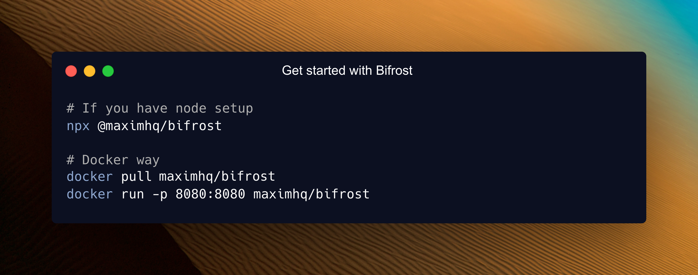

## 30-Second Setup

Get Bifrost running as a blazing-fast HTTP API gateway with **zero configuration**. Connect to any AI provider (OpenAI, Anthropic, Bedrock, and more) through a unified API that follows **OpenAI request/response format**.

### 1. Choose Your Setup Method

Both options work perfectly - choose what fits your workflow:

#### NPX Binary

<video width="100%" controls>
  <source src="https://github.com/maximhq/bifrost/raw/refs/heads/main/docs/media/run-npx.mp4" type="video/mp4" />
  Your browser does not support the video tag.
</video>

```bash
# Install and run locally
npx -y @maximhq/bifrost
```

#### Docker

```bash
# Pull and run Bifrost HTTP API
docker pull maximhq/bifrost
docker run -p 8080:8080 maximhq/bifrost
```

**For Data Persistence**

```bash
# For configuration persistence across restarts
docker run -p 8080:8080 -v $(pwd)/data:/app/data maximhq/bifrost
```
### 2. Configuration Flags

| Flag | Default | NPX | Docker | Description |
|------|---------|-----|--------|-------------|
| port | 8080 | `-port 8080` | `-e APP_PORT=8080 -p 8080:8080` | HTTP server port |
| host | localhost | `-host 0.0.0.0` | `-e APP_HOST=0.0.0.0` | Host to bind server to |
| log-level | info | `-log-level info` | `-e LOG_LEVEL=info` | Log level (debug, info, warn, error) |
| log-style | json | `-log-style json` | `-e LOG_STYLE=json` | Log style (pretty, json) |


**Understanding App Directory**

The `-app-dir` flag determines where Bifrost stores all its data:

```bash
# Specify custom directory
npx -y @maximhq/bifrost -app-dir ./my-bifrost-data

# If not specified, creates in your OS config directory:
# • Linux/macOS: ~/.config/bifrost
# • Windows: %APPDATA%\bifrost
```

**What's stored in app-dir:**
- `config.json` - Configuration file (optional)
- `config.db` - SQLite database for UI configuration  
- `logs.db` - Request logs database

**Note:** When using Bifrost via Docker, the volume you mount will be used as the app-dir.

### 3. Open the Web Interface

Navigate to **http://localhost:8080** in your browser:

```bash
# macOS
open http://localhost:8080

# Linux  
xdg-open http://localhost:8080

# Windows
start http://localhost:8080
```

🖥️ **The Web UI provides:**
- **Visual provider setup** - Add API keys with clicks, not code
- **Real-time configuration** - Changes apply immediately
- **Live monitoring** - Request logs, metrics, and analytics
- **Governance management** - Virtual keys, usage budgets, and more

### 4. Test Your First API Call

```bash
curl -X POST http://localhost:8080/v1/chat/completions \
  -H "Content-Type: application/json" \
  -d '{
    "model": "openai/gpt-4o-mini",
    "messages": [{"role": "user", "content": "Hello, Bifrost!"}]
  }'
```

**🎉 That's it!** Bifrost is running and ready to route AI requests.

### What Just Happened?

1. **Zero Configuration Start**: Bifrost launched without any config files - everything can be configured through the Web UI or API
2. **OpenAI-Compatible API**: All Bifrost APIs follow OpenAI request/response format for seamless integration
3. **Unified API Endpoint**: `/v1/chat/completions` works with any provider (OpenAI, Anthropic, Bedrock, etc.)
4. **Provider Resolution**: `openai/gpt-4o-mini` tells Bifrost to use OpenAI's GPT-4o Mini model
5. **Automatic Routing**: Bifrost handles authentication, rate limiting, and request routing automatically

---

## Two Configuration Modes

Bifrost supports **two configuration approaches** - you cannot use both simultaneously:

### Mode 1: Web UI Configuration


**When the UI is available:**
- No `config.json` file exists (Bifrost auto-creates SQLite database)
- `config.json` exists with `config_store` configured

### Mode 2: File-based Configuration

**When to use:** Advanced setups, GitOps workflows, or when UI is not needed

Create `config.json` in your app directory:

```json
{
  "client": {
    "drop_excess_requests": false
  },
  "providers": {
    "openai": {
      "keys": [
        {
          "value": "env.OPENAI_API_KEY",
          "models": ["gpt-4o-mini", "gpt-4o"],
          "weight": 1.0
        }
      ]
    }
  },
  "config_store": {
    "enabled": true,
    "type": "sqlite",
    "config": {
      "path": "./config.db"
    }
  }
}
```

**Without `config_store` in `config.json`:**
- **UI is disabled** - no real-time configuration possible
- **Read-only mode** - `config.json` is never modified
- **Memory-only** - all configurations loaded into memory at startup
- **Restart required** - changes to `config.json` only apply after restart

**With `config_store` in `config.json`:**
- **UI is enabled** - full real-time configuration via web interface
- **Database check** - Bifrost checks if config store database exists and has data
  - **Empty DB**: Bootstraps database with `config.json` settings, then uses DB exclusively
  - **Existing DB**: Uses database directly, **ignores** `config.json` configurations
- **Persistent storage** - all changes saved to database immediately

**Important for Advanced Users:**
If you want database persistence but prefer not to use the UI, note that modifying `config.json` after initial bootstrap has no effect when `config_store` is enabled. Use the public HTTP APIs to make configuration changes instead.

**The Three Stores Explained:**
- **Config Store**: Stores provider configs, API keys, MCP settings - Required for UI functionality
- **Logs Store**: Stores request logs shown in UI - Optional, can be disabled  
- **Vector Store**: Used for semantic caching - Optional, can be disabled

---

## Next Steps

Now that you have Bifrost running, explore these focused guides:

### Essential Topics

- **[Provider Configuration](./provider-configuration)** - Multiple providers, automatic failovers & load balancing
- **[Integrations](../../integrations/what-is-an-integration)** - Drop-in replacements for OpenAI, Anthropic, and GenAI SDKs
- **[Multimodal Support](./multimodal)** - Support for text, images, audio, and streaming, all behind a common interface.

### Advanced Topics

- **[Tracing](../../features/tracing)** - Logging requests for monitoring and debugging
- **[MCP Tools](../../features/mcp)** - Enable AI models to use external tools (filesystem, web search, databases)
- **[Governance](../../features/governance)** - Usage tracking, rate limiting, and cost control
- **[Deployment](../../deployment/docker-setup)** - Production setup and scaling

---

**Happy building with Bifrost!** 🚀
