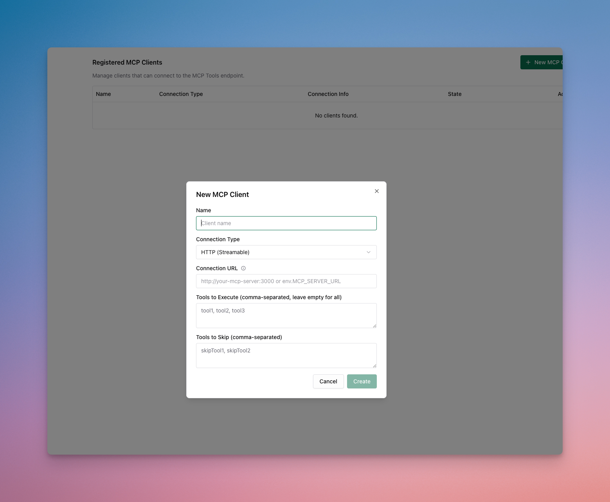

## Function Calling with Custom Tools

Enable AI models to use external functions by defining tool schemas using OpenAI format. Models can then call these functions automatically based on user requests.

```bash
curl --location 'http://localhost:8080/v1/chat/completions' \
--header 'Content-Type: application/json' \
--data '{
    "model": "openai/gpt-4o-mini",
    "messages": [
        {"role": "user", "content": "What is 15 + 27? Use the calculator tool."}
    ],
    "tools": [
        {
            "type": "function",
            "function": {
                "name": "calculator",
                "description": "A calculator tool for basic arithmetic operations",
                "parameters": {
                    "type": "object",
                    "properties": {
                        "operation": {
                            "type": "string",
                            "description": "The operation to perform",
                            "enum": ["add", "subtract", "multiply", "divide"]
                        },
                        "a": {
                            "type": "number",
                            "description": "The first number"
                        },
                        "b": {
                            "type": "number",
                            "description": "The second number"
                        }
                    },
                    "required": ["operation", "a", "b"]
                }
            }
        }
    ],
    "tool_choice": "auto"
}'
```

**Response includes tool calls:**
```json
{
    "choices": [{
        "message": {
            "role": "assistant", 
            "tool_calls": [{
                "id": "call_abc123",
                "type": "function",
                "function": {
                    "name": "calculator",
                    "arguments": "{\"operation\":\"add\",\"a\":15,\"b\":27}"
                }
            }]
        }
    }]
}
```

## Connecting to MCP Servers

Connect to Model Context Protocol (MCP) servers to give AI models access to external tools and services without manually defining each function.

<Tabs group="tool-calling">
<Tab title="Using Web UI">


1. Go to **http://localhost:8080**
2. Navigate to **"MCP Clients"** in the sidebar
3. Click **"Add MCP Client"**
4. Enter server details and save
</Tab>

<Tab title="Using API">
```bash
curl --location 'http://localhost:8080/api/mcp/client' \
--header 'Content-Type: application/json' \
--data '{
    "name": "filesystem",
    "connection_type": "stdio",
    "stdio_config": {
        "command": ["npx", "@modelcontextprotocol/server-filesystem", "/tmp"],
        "args": []
    }
}'
```

**List configured MCP clients:**
```bash
curl --location 'http://localhost:8080/api/mcp/clients'
```
</Tab>

<Tab title="Using config.json">
```json
{
    "mcp": {
        "client_configs": [
            {
                "name": "filesystem",
                "connection_type": "stdio",
                "stdio_config": {
                    "command": ["npx", "@modelcontextprotocol/server-filesystem", "/tmp"],
                    "args": []
                }
            },
            {
                "name": "youtube-search",
                "connection_type": "http",
                "connection_string": "http://your-youtube-mcp-url"
            }
        ]
    }
}
```
</Tab>

</Tabs>

Read more about MCP connections and advanced end to end tool execution in the [MCP Features](../../features/mcp) section.

## Tool Choice Options

Control how the AI uses tools:

```bash
# Force use of specific tool
"tool_choice": {
    "type": "function",
    "function": {"name": "calculator"}
}

# Let AI decide automatically (default)
"tool_choice": "auto"

# Disable tool usage
"tool_choice": "none"
```

## Next Steps

Now that you understand tool calling, explore these related topics:

### Essential Topics

- **[Multimodal AI](./multimodal)** - Process images, audio, and multimedia content
- **[Streaming Responses](./streaming)** - Real-time response generation with tool calls
- **[Provider Configuration](./provider-configuration)** - Multiple providers for redundancy
- **[Integrations](./integrations)** - Drop-in compatibility with existing SDKs

### Advanced Topics

- **[MCP Features](../../features/mcp)** - Advanced MCP server management and configuration
- **[Core Features](../../features/)** - Advanced Bifrost capabilities
- **[Architecture](../../architecture/)** - How Bifrost works internally
